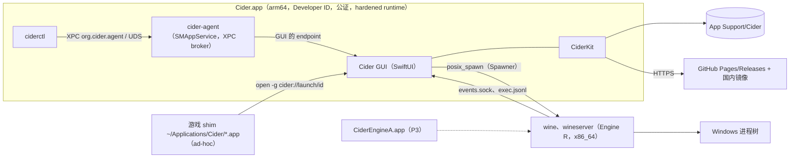
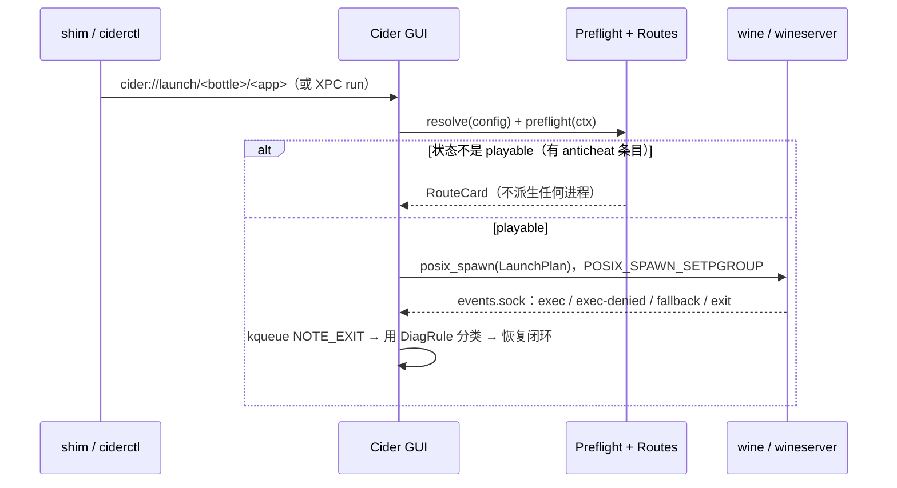
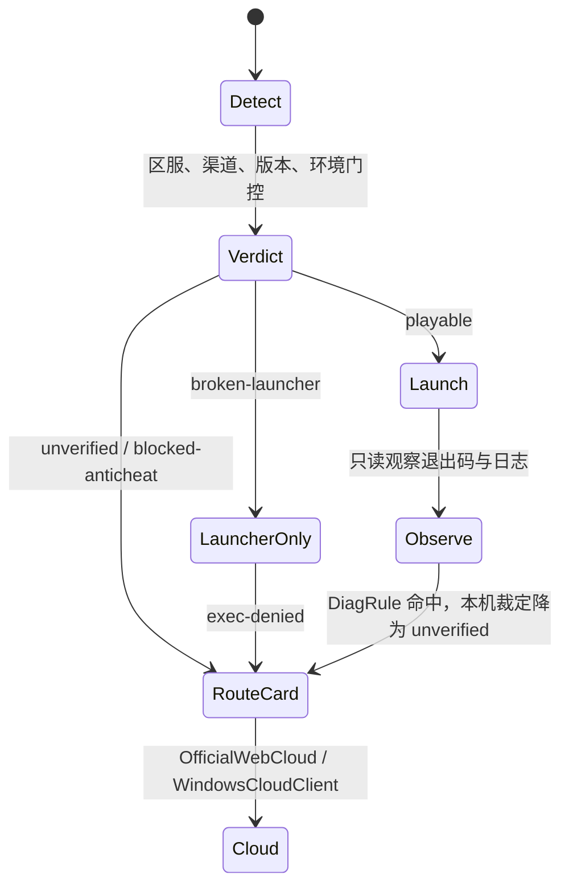

# 总体架构、仓库布局与数据模型

> 版本 v1 · 2026-09-27 · 依赖文档：`00-strategy-and-decisions.md`（ADR-001…012 为硬约束）；调研 01、02、06、11、12、15、16、21、22 及 00-research-review 裁定。下游：02–13 号计划文档引用本文的接口与 schema。

## 目标与范围（含明确不做的事）

**目标**
1. 定义 Cider 的组件与进程模型：谁派生 Wine、谁持有 TCC 身份、各进程如何通信。
2. 定义仓库布局（monorepo + 卫星仓库），让 CiderKit 只靠 CLT 就能 `swift test`（开发机无 Xcode）。
3. 定义带版本的 on-disk 数据：bottle、程序、引擎/组件包、签名 feed，以及迁移规则。
4. 定义配置分层与解析算法，保证“回退可见”（原则 6）、红线进 schema（原则 7）。
5. 定义日志诊断、安全模型、扩展点，以及 R3 路线提供者（route provider）的接入方式。

**范围**：跨文档的骨架与契约。补丁队列（02）、Engine A 细节（03）、后端矩阵（04）、UI（05）、数据内容（06）、HoYo 规则（09）只引用，不展开。

**明确不做**
- 不把 Wine 放进 Cider.app；CLI 不自己派生 wine（ADR-007/008）。
- 不做 Web UI、动态插件加载、profile/recipe 脚本、任何宿主 shell 步骤（ADR-009）。
- 不做 32 位 bottle、Intel、Engine V 产品化（ADR-001/003）。
- 路线枚举中**不存在任何 iOS/iPadOS 形态**（含 Mac App Store 上的 iPhone/iPad App、PlayCover 及任何 iOS 运行器），也不接第三方云（ADR-010）。
- 不提供绕过预检、关闭 exec-guard 的开关，测试员也不例外。
- 不默认遥测。

## 现状与关键事实

| # | 事实 | 来源 | 置信度 | 架构含义 |
|---|---|---|---|---|
| F1 | 经 LaunchServices 启动的 GUI `posix_spawn` 子进程时，TCC 与本地网络归到 Cider.app；SMAppService agent 派生时归属存疑 | [16 §1] | 实测 / 存疑 | v0 由 GUI 派生；派生者做成接口，T13 后再议 |
| F2 | Rosetta 下的 x86_64 代码可以不签名，arm64 至少 ad-hoc；App 自己下载的文件不带 quarantine | [12 §2.2、§2.4] | 证实 | Engine R 放 bundle 外、ad-hoc；完整性只靠自有签名清单 |
| F3 | 有限实验中 spawn 型 shim 没进 Game Mode，exec 型和“loader 即主程序”进了 | [16 §2 E3] | 实测，证据有限 | 默认模型 E；模型 B 等 T4 |
| F4 | Metal 缓存目录按进程内 `NSBundle.mainBundle` 分；winemac 没有 openFiles/openURLs 处理 | [16 §2] | 实测 / 证实 | 所有 Wine 进程共用一个缓存目录；文档/URL 类型登记在 Cider.app |
| F5 | 签名 bundle 内的代码目录应扁平；Wine 多层 `lib/wine/*-unix` 不宜放入 | [12 §2.2 更正] | 证实 | 引擎独立包 |
| F6 | bsdtar 能处理 xz，不支持 zstd；Sparkle 2.10.0 最低 macOS 12，EdDSA，支持 channel 与分批推送 | [12 §2.5、§2.6] | 本机 / 证实 | 引擎用 `.tar.xz`；App 用 Sparkle |
| F7 | 换引擎时 `wineboot` 会按 `.update-timestamp` 隐式升级 prefix | [12 §4.5] | 证实 | 换引擎前做 APFS 快照，记 `engineHistory` |
| F8 | Whisky 引擎托管在个人 CDN，项目停更后返回 404 | [11 §1.4] | 高 | 组织名下托管，加国内镜像 |
| F9 | WhiskyKit 的 PE、ShellLink、Tar、按程序设置可复用；CrossOver 只能按 bottle 设置 | [11 §1.1–1.2]、[01 §6] | 高 | 设“程序层”配置 |
| F10 | umu-ID 是不透明字符串，不都是 Steam AppID | [11 §13 核查] | 证实 | 主键用 string |
| F11 | D3DMetal 只有 x86_64；按 GFXT 语义可复刻宿主契约 | [02 摘要 核查]、[00 裁定 10] | 中高 | D3DMetal 作为导入组件，按引擎 capability 门控 |
| F12 | Engine A 需要受限 entitlement，大概率要 app 形态 bundle 加 profile | [15 摘要]、[16 §4] | 证实 / 推断中高 | 引擎包声明 `packaging`，派生者按形态启动 |
| F13 | HoYo 失败签名（WDFLDR 缺失 → `initDriver [4,1114,0]` 等）可以只读识别；预检状态机分四态 | [21 §2.3]、[22 §5.2] | 证实 | DiagRule + RouteProvider |
| F14 | 绝区零日服云的“Mac”形态疑似 iPad App | [22 核查 再核] | 存疑，低 | `form` 枚举不含 iOS；`unverified` 不展示 |
| F15 | CEF 参数改写宜在子进程 `loader_init` 早期完成，规则放在 `AppDefaults\<exe>\Cider` | [18 §设计] | 推断 | cider-rules 的物化位置 |

## 设计

### 1 组件与进程模型



| 组件 | 形态 | 职责 | 签名 |
|---|---|---|---|
| Cider GUI | Cider.app 主程序 | UI、Sparkle、**唯一的 wine 派生者**（v0），TCC 身份的持有者 | Developer ID；entitlement 只有 audio-input、camera |
| cider-agent | `Contents/Library/LaunchAgents` 登记的 SMAppService agent | P1 起提供 XPC rendezvous：保存 GUI 的 `NSXPCListenerEndpoint`，GUI 未运行时用 `NSWorkspace.openApplication(activates:false)` 拉起它。**不派生 wine** | 同 App |
| ciderctl | `Contents/MacOS/ciderctl`，安装时链接到 `~/.local/bin` | CLI；所有副作用操作都转交 GUI；纯只读命令（`probe`、`schema validate`）在本地执行 | 同 App |
| CiderKit | SwiftPM 包 | 全部业务逻辑；无 UI 依赖 | — |
| cider-probe | C，`Contents/Helpers` | 输出宿主能力 JSON（Rosetta、4K、x18、TSO、MAP_JIT、macOS 版本） | Developer ID |
| Engine R/A/V | `Engines/<id>` | R：x86_64 Wine + 新 WoW64；A：arm64 + FEX（P3）；V：schema 中预留，2027 年不实现 | R 为 ad-hoc；A 为 Developer ID + profile |
| Components | `Components/<kind>/<ver>` | DXMT、D3DMetal（用户导入）、WebView2 Fixed、mtld3d、cnc-ddraw、KosmicKrisp 等 | 随包清单签名；D3DMetal 保留 Apple 原签名 |
| 引擎内置运行时 | 引擎树内 | GStreamer 1.28（重定位后设 `GST_PLUGIN_SYSTEM_PATH`、`GST_PLUGIN_SCANNER`）、sdl2-compat + SDL3（作为 `libSDL2-2.0.0.dylib`）、MoltenVK、wine-mono、wine-gecko（共享在 `share/wine`） | 与引擎同一份清单 |
| cider-helper.exe | 随引擎提供的 PE | 在 bottle 内执行 `ps`、`windows`、`close`、`reg-export`、`shell-open`，stdout 输出 JSON | 属于资源文件 |

**CiderKit 模块**：`CiderCore`（ID、错误、SemVer）、`CiderSchema`（Codable 模型与迁移）、`CiderConfig`（分层解析）、`CiderStore`（引擎、组件、下载、GC）、`CiderTrust`（minisign 验证、feed 状态）、`CiderBottle`（生命周期、快照）、`CiderRuntime`（Spawner、会话、wineserver、事件）、`CiderData`（recipe/profile/verdict 匹配、cider-rules 物化）、`CiderPreflight`、`CiderRoutes`、`CiderDiag`、`CiderIPC`、`CiderPE`（吸收 WhiskyKit 的 PE/ShellLink/Tar）、`CiderIntegration`（shim、`cider://`、启动器库扫描）。除 `CiderIntegration` 的 LaunchServices 部分外，其余模块都能在 CLT 下测试。

### 2 进程、会话与 IPC



**Spawner 接口**（派生者可替换，ADR-007）：

```swift
public protocol Spawner: Sendable {
  func launch(_ plan: LaunchPlan) async throws -> SessionHandle
  func terminate(_ id: SessionID, _ mode: TerminateMode) async   // .window(helper close) | .tree | .bottle(wineserver -k)
}
public struct LaunchPlan: Codable, Sendable {
  public var bottle: BottleID, engine: EngineID
  public var loader: URL                 // R: Engines/<id>/bin/wine；A: CiderEngineA.app/Contents/MacOS/wine
  public var argv: [String], env: [String: String], cwd: URL
  public var configDigest: String        // ResolvedConfig 的 sha256
  public var route: RouteDecision        // 预检结论随计划携带；非 playable 的 anticheat 条目在这里被二次拒绝
}
```

实现有三个：`GUISpawner`（默认）、`AgentSpawner`（T13 证明归属正确后才启用）、`DirectSpawner`（只在 `CIDER_DEV` 构建和 CI 中使用）。每次派生都往 `~/Library/Logs/Cider/audit/spawn.jsonl` 追加一行，这就是“进程审计”的宿主侧记录。

**会话与 wineserver**：每个 bottle 一个 wineserver。一个会话等于一次 `LaunchPlan` 加上它的进程组。Cider 用 `wineserver -w` 等待 bottle 空闲。`sync`（msync/server）的 restartScope 是 `wineserver`：模式切换时如果有会话在跑，先提示用户，再 `wineserver -k` 并重新拉起（ADR-005）。每次启动 R 引擎前，env gate 会检查 Rosetta 是否存在（`cider-probe --rosetta`），缺失时进入安装引导，不静默失败。

**GUI/CLI 协议**（`CiderControlProtocol`，传输无关）：消息是带版本的 JSON 帧。XPC 下用 `Data` 承载；UDS（`~/Library/Application Support/Cider/run/control.sock`，所在目录权限 0700）下用 4 字节长度前缀。UDS 用于开发、CI，以及 agent 被用户在“登录项”里关闭时的回退。

```json
{"v":1,"id":"c7","method":"run","params":{"bottle":"steam-7f3a","app":"steam","args":[],"wait":false}}
{"v":1,"id":"c7","result":{"session":"s-20261003-0012","pid":48211,"route":{"state":"n/a"}}}
{"v":1,"event":"session.exit","params":{"session":"s-20261003-0012","code":0,"class":null}}
```

方法：`bottle.{list,create,delete,snapshot,restore,switchEngine,export,import}`、`run`、`sessions`、`terminate`、`engine.{list,install,verify,gc}`、`component.{list,install,import}`、`config.{get,set,explain}`、`preflight`、`diag.bundle`、`data.sync`。`ciderctl <cmd> --json` 输出与 `result` 同构，LRS（08）和实验室（11）直接消费。

**Wine → Cider 通道**（`cider-wine` 中的 `cider-integration` 主题，目标 ≤400 行，改动集中在独立文件中）：
- 环境变量：`CIDER_SESSION`、`CIDER_EVENTS=<run>/<session>.sock`（SOCK_DGRAM，非阻塞，发送失败就丢弃）。
- **exec-audit**：ntdll unix 侧在 `NtCreateUserProcess` 中把 `{t,pid,ppid,image,ok}` 追加到 `<bottle>/.cider/run/exec.jsonl`，同时发一条事件。
- **exec-guard**：Cider 在会话前把 `HKLM\Software\Cider\ExecGuard`（REG_MULTI_SZ，每行一条 JSON）写成当前裁定：非 playable 游戏的 image 名加原因。匹配时返回 `STATUS_ACCESS_DENIED` 并发出 `exec-denied`，GUI 随即弹出路线卡。它只拒绝创建进程，不触碰反作弊；引擎里没有任何关闭它的环境变量。
- **fallback 事件**：后端降级时（例如 D3DMetal 未导入而回退到 DXMT）由后端或 Cider 发出 `fallback{key,wanted,got,reason}`。
- `wine_get_version()` 带 Cider 构建号，保持可识别（ADR-010）。

### 3 仓库布局

```
cider/                         # monorepo（公开）
  App/                         # project.yml（XcodeGen）；Cider/、CiderAgent/、Shims/{GameShim,HandlerShim}/
  Packages/CiderKit/           # Package.swift；Sources/<上述模块>/；Tests/（fixtures 放 Tests/Fixtures）
  Tools/ciderctl/  Tools/cider-probe/（C + Makefile）  Tools/cider-helper/（PE，mingw 构建）
  engine/                      # recipes/{engine-r,engine-a}.yaml；deps/*.yaml；components/*.yaml；scripts/{build,bundle-dylibs,smoke,make-manifest}
  schemas/                     # bottle-1、app-1、engine-manifest-1、index-1、session-1、config-keys（JSON Schema）
  scripts/                     # sign.sh、notarize.sh、dmg.sh、appcast.sh、keys/ceremony.md
  docs/{plan,research,policy,tasks}/   CLAUDE.md   .github/workflows/
```

| 卫星仓库 | 内容 | 发布 |
|---|---|---|
| `cider-wine` | Wine fork；`cider/devel` 按主题拆提交，尾注由 CI 强制（ADR-004） | 源码 tag；引擎由 `cider` 的 `engine-build` 构建 |
| `cider-data`（CC0） | `recipes/`、`profiles/`、`verdicts/`、`diag-rules/`、`schema/`；红线 lint | minisign 签名快照 → Pages + 镜像 |
| `cider-engines` | 只放 release 资产，不放代码 | GitHub Releases；`index.json` 发到 Pages |
| `cider-lab`（私有） | 自托管 runner、LRS 与游戏冒烟、HoYo 回放 | 只拉取已签名产物 |
| `cider-dxmt` 等 | 仅在必须带补丁时才 fork | — |

### 4 磁盘布局与 bottle 格式

```
~/Library/Application Support/Cider/
  Engines/<engine-id>/{manifest.json, files.sha256, bin/, lib/, share/wine/{mono,gecko}/}
  Components/<kind>/<version>/{component.json, …}
  Bottles/<bottle-id>/
    cider-bottle.json    apps/<app-id>.json    prefix/          # prefix = WINEPREFIX
    .cider/{state/applied.json, run/, snapshots/<ts>/, lock}
  Data/{snapshots/<revision>/, trust/state.json}                # state.json 记录 lastRevision
  State/{settings.json, shortcuts.json, local-verdicts.json}    Cache/<sha256>   Handlers/<scheme>.app
~/Applications/Cider/<Name>.app          ~/Library/Logs/Cider/{cider.log, audit/, sessions/}
```

`cider-bottle.json`（schema 1）：

```json
{
  "schemaVersion": 1, "id": "hoyo-zzz-2c1e", "name": "绝区零（Steam）",
  "createdBy": "cider/0.1.0", "template": "win10_64", "arch": "win64-wow64",
  "cpu_backend": "rosetta-x86_64",
  "engine": {"id": "cider-r-11.19-c1-x86_64", "pin": "minor"},
  "engineHistory": [{"from": "cider-r-11.18-c2-x86_64", "to": "cider-r-11.19-c1-x86_64",
                     "at": "2026-10-04T12:00:00Z", "snapshot": "20261004T1200"}],
  "components": {"dxmt": {"version": "0.80-c1", "pin": "exact"},
                 "d3dmetal": {"source": "user-import", "version": "3.0", "enabled": false},
                 "webview2": {"channel": "cider-fixed", "version": "151.0.4129.78"}},
  "locale": {"ui": "zh-Hans", "LC_ALL": "zh_CN.UTF-8", "acp": 936},
  "graphics": {"d3d12": "route:R"},
  "drives": {"d": {"host": "/Volumes/Games/Cider", "snapshot": false}},
  "integration": {"shellFolders": "isolated", "zDrive": false},
  "settings": {"sync": "msync"},
  "overrides": {},
  "freeze": null,
  "profilesApplied": [{"id": "launcher.steam", "rev": 42, "sha256": "…"}]
}
```

`apps/<app-id>.json` 记录 `exe`（Windows 路径）、`match`（`sha256`、PE 时间戳、`umuId`、`steamAppId`）、`args`、`settings`、`overrides`、`shortcut.bundleId`（`org.cider.shim.<bottle>.<app>`）。

**版本规则**：`schemaVersion` 为整数。迁移函数 `vN→vN+1` 是纯函数且幂等，迁移前备份为 `cider-bottle.json.bak-vN`。遇到比自己新的 schema 时，App 只读打开并提示升级（配合引擎清单的 `requires.minApp`）。未知字段只允许 `x-` 前缀，其余一律拒绝。大体积游戏目录通过 `drives` 挂到 bottle 外，不参与快照；快照用 `clonefile(2)`；卷不支持 APFS clone 时拒绝换引擎，除非用户确认做一次整份复制。

### 5 引擎/组件包与签名清单

包格式为 `.tar.xz`，根目录含 `manifest.json` 和 `files.sha256`。`engines/index.json` 的条目内嵌同一份 manifest，并加上 `artifact`、`channel`、`yanked`：

```json
{
  "schemaVersion": 1, "id": "cider-r-11.19-c1-x86_64", "flavor": "R", "channel": "beta",
  "wine": {"base": "wine-11.19", "tree": "cider-wine@3f2a9c1", "activePatches": 74},
  "arch": {"unix": "x86_64", "pe": ["x86_64-windows", "i386-windows"]},
  "cpu_backend": "rosetta-x86_64", "packaging": "tree",
  "requires": {"macos": "14.0", "rosetta": true, "minApp": "0.1.0", "bottleSchema": [1, 1]},
  "capabilities": {"sync": ["msync", "server"], "d3dmetalHost": "gfxt-1", "ciderIntegration": 1},
  "bundled": {"wine-mono": "11.3.0", "wine-gecko": "2.47.4", "gstreamer": "1.28.7",
              "sdl3": "3.4.16", "sdl2-compat": "2.32.72", "moltenvk": "<ADR-006 锁定版>"},
  "defaults": {"sync": "msync", "graphics.d3d11": "dxmt", "components": {"dxmt": "0.80-c1"}},
  "build": {"run": "https://github.com/<org>/cider/actions/runs/<id>", "pe_toolchain": "mingw-w64-gcc"},
  "files": {"tree_sha256": "…", "count": 3812},
  "artifact": {"sha256": "…", "size": 187654321, "path": "r/11.19-c1.tar.xz"},
  "yanked": false
}
```

Engine A 的条目写 `"packaging": "loaderBundle"`，loader 位于 `CiderEngineA.app`；引擎树放在 bundle 内还是外，由 T9 决定（03）。组件的 `component.json` 带 `kind`、`version`、`arch`、`compat.engines`（semver 区间）和 `install`（布局声明）。D3DMetal 导入器不下载任何东西：它校验 Apple 签名（`codesign -v` 加 anchor apple）并记录 `lipo -archs` 和版本，然后原样复制进 `Components/d3dmetal/<ver>/`。

**安装算法**（原子操作）：①取 `timestamp.json`，验签，检查未过期且 `revision ≥ lastRevision`；②测速选镜像，按 sha256 寻址下载到 `Cache/<sha256>.part`，支持断点续传，校验大小和 sha256；③安全解包到 `Engines/.staging-<id>`（拒绝绝对路径、`..`、指向树外的符号链接、设备文件、setuid 位）；④比对 manifest 与 index，重算 `tree_sha256`；⑤冒烟：`bin/wine --version` 必须含构建号；⑥`rename(2)` 就位。GC 回收条件：没有 bottle 引用，且不在每条线最近 2 个版本之内，且未被 pin。

### 6 更新通道与信任链

| 通道 | 内容 | 签名 | 频率 / 语义 |
|---|---|---|---|
| App | Sparkle appcast，stable/beta 两个 channel，支持分批推送 | Sparkle EdDSA（独立密钥） | 两份 feed（GitHub、国内镜像）；启动时按测速在 `feedURLString(for:)` 中选 |
| 引擎/组件 | `engines/index.json`：stable/beta/nightly（nightly 只对开发者开放） | minisign，`engines` 角色 | `yanked` 条目不再新装，已装的 bottle 收到提示 |
| 数据 | `cider-data` 快照 `data/<rev>/bundle.tar.xz` | minisign，`data` 角色 | `revision` 单调递增，防回滚 |
| 新鲜度 | `timestamp.json` | `timestamp` 角色（CI 在线，低权限） | 7 天过期；过期时 HoYo 的 `playable` 一律按 `unverified` 处理 |
| 根 | `root.json`：各角色公钥与过期时间 | 离线根密钥，两人持有 | 轮换时由新 root 交叉签名；App 内置 root 公钥 |

镜像只是不可信的传输通道：`mirrors.json` 由 `data` 角色签名，对象路径为 `/<sha256[0:2]>/<sha256>`。游戏本体一律走官方 CDN。

### 7 配置分层与解析

| 层 | 存放位置 | 由谁写入 |
|---|---|---|
| L0 引擎默认 | manifest `defaults` | 引擎构建 |
| L1 全局 | `State/settings.json` | 用户偏好 |
| L2 bottle | `cider-bottle.json.settings` | 模板或用户 |
| L3 程序/exe | `apps/<id>.json.settings` | 自动识别或用户 |
| L4 profile | `cider-data` 中签名的 profile，按 `when` 匹配后执行类型化动作 | 维护者热修 |
| L5 用户锁定 | `overrides`（bottle 或程序级） | 用户显式“锁定”，或 `ciderctl config set --pin` |
| 门控 / 钳制 | 代码与数据 | 不可覆盖：功能门控、红线、Denuvo 冻结 |

所有配置键在 `ConfigKey` 注册表中声明：类型、允许的作用域、默认值、`restartScope ∈ {session, wineserver, prefix}`、门控条件、物化方式（env、`WINEDLLOVERRIDES`、AppDefaults 注册表、cider-rules、组件 overlay）。注册表导出为 `schemas/config-keys.json`，供 06 的数据 lint 引用。

```text
resolve(bottle, app?, ctx) -> Resolved
  v = merge(L0, L1, L2, L3)                    # 标量后写覆盖；env、dll 等 map 深合并，null 表示删除
  for p in data.match(ctx) sorted by (specificity: exeSha > umuId+exe > umuId > launcher > generic, prio, id):
      for a in p.actions where a.when(ctx): apply(a, v, prov="profile:"+p.id+"@"+p.rev)
  apply(L5 overrides, prov="user")
  for k in v: if !gate(k, v[k], host, engine, components):     # macOS 版本、engine capability、D3DMetal 是否导入
      v[k] = fallbackChain(k).first(gateOK); fallbacks += {k, wanted, got, reason}
  clamp(v, policy(ctx.anticheat, ctx.drm))     # hoyoverse：GPU 身份 honest、nvapi off、红线 env 拒绝；Denuvo：冻结
  return Resolved{values, provenance, fallbacks, clamps, restart, digest=sha256(canonical(values))}
```

`ctx` 包含 umu-ID、exe 名与 sha256、Steam AppID、渠道、引擎主版本、macOS 主版本、`cpu_backend`。`ciderctl config explain -b <id> --app <id> [key]` 按层列出每个键的来源。fallbacks 和 clamps 会写进会话清单，并在 UI 上显示（原则 6）。

### 8 日志与诊断

- **App 日志**：`Logger(subsystem: "org.cider", category: engine|spawn|ipc|data|route|update|trust)`，同时镜像到 `~/Library/Logs/Cider/cider.log`（5 个文件轮转，每个 10 MB）。
- **会话目录**：`sessions/<bottle>/<时间>-<app>/`，内含 `session.json`（引擎、组件、配置摘要与 explain、路线决策、probe 摘要、macOS、芯片、Rosetta 状态）、`wine.log`（stdout/stderr）、`exec.jsonl`、`events.jsonl`、`classify.json`，可选 `metal-hud.log`。每个 bottle 保留最近 20 个会话，总量不超过 500 MB。
- **WINEDEBUG 预设**：`default=fixme-all`、`install=+seh,+tid,+loaddll`、`hoyo=+module,+ntoskrnl,+seh,+loaddll`、`custom`（对应 CrossOver 的 Run with Options）。
- **DiagRule**（随 `cider-data` 签名下发）：`{"id":"hoyo.wdfldr-missing","file":"wine.log","regex":"import_dll Library WDFLDR\\.SYS.*not found","class":"DRIVER_IMPORT_MISSING","route":"blocked-anticheat"}`。会话退出后逐条匹配；同一套引擎也用于回放测试。
- **诊断包** `ciderctl diag bundle`：会话目录、配置 explain、probe JSON、引擎清单，以及时间窗内进程名为 wine* 或 *.exe 的 `.ips`。脱敏：`$HOME→~`、用户名、`C:\users\<name>`、邮箱、IP、URL 查询串、长 token。导出前先预览，默认不上传。

### 9 安全模型

- **信任边界**：Cider.app 可信；引擎和数据在验签后可信，但数据只能以类型化动作生效；镜像不可信；Windows 程序不可信（Wine 不是沙箱）；shim 由本机生成，完整 ad-hoc 签名后执行 `codesign --verify`；D3DMetal 只校验，不修改。
- **数据中没有宿主 shell**：recipe 执行器只做下载（必须带 sha256 和大小，仅 HTTPS）、在 bottle 内调用 Windows 安装程序、在 bottle 根目录下做文件操作（先解析符号链接，再做前缀检查）。profile 的 env 键走白名单（`WINE*`、`DXMT_*`、`D3DM_*`、`MTL_HUD_*`、`MVK_*`、`ROSETTA_ADVERTISE_AVX`、`WEBVIEW2_*`），`DYLD_*` 永远拒绝。
- **红线纵深**：数据 CI lint、客户端加载时再校验一次、解析器钳制、Spawner 二次拒绝、引擎 exec-guard，五道。
- **IPC 认证**：XPC 设置 `setCodeSigningRequirement`（anchor apple generic，且 Team ID 为本团队）；UDS 检查 `getpeereid` 与 `LOCAL_PEERTOKEN` 审计令牌对应的代码签名。
- **bottle 默认值**：shell 文件夹隔离（不链接到 `~/Documents` 等）；游戏 bottle 不映射 Z:；从 Finder 打开的 exe 读取 `com.apple.quarantine`，提示下载来源。

### 10 扩展点

```swift
protocol EngineProvider   { var flavor: EngineFlavor { get }; func availability(_ h: HostCaps) -> Availability; func loader(for: Engine) throws -> URL }
protocol GraphicsBackend  { var id: String { get }; var apis: Set<D3DAPI> { get }; func gate(_ c: GateContext) -> GateResult; func materialize(_ e: inout LaunchEnv, _ b: Bottle) throws }
protocol ComponentKind    { var kind: String { get }; func verify(_ dir: URL) throws -> ComponentManifest }
protocol PreflightCheck   { var id: String { get }; func run(_ c: PreflightContext) async -> CheckResult }
protocol RouteProvider    { /* 见 §11 */ }
protocol LauncherIntegration { func scan(_ b: Bottle) async -> [DetectedApp] }   // Steam libraryfolders.vdf、HoYoPlay 配置等
```

所有实现都在编译期注册，没有动态插件。新增一个后端要做：`ConfigKey` 取值加一项、`gate` 与 `fallbackChain`、`component.json` 与构建配方、CI 冒烟、在 `docs/parity.md` 登记。组件注入目前靠 `WINEDLLPATH`，它的查找优先级待验证（见未决问题）。

### 11 R3 路线提供者

```swift
enum RouteKind: String, Codable { case pcClient = "pc-client", officialCloud = "official-cloud", native }
enum CloudForm: String, Codable { case web, windowsCloudClient = "windows-cloud-client", nativeMacOS = "native-macos", unverified }
protocol RouteProvider {
  var kind: RouteKind { get }
  func availability(_ g: GameEntry, _ ed: Edition, _ h: HostContext) async -> RouteAvailability
  func execute(_ d: RouteDecision) async throws
}
```

`CloudForm` 里没有 iOS 值，数据中出现未知值会直接解码失败，该路线不展示；JSON Schema 用 `enum` 加 `additionalProperties:false`，CI 另外扫描禁用词。

| Provider | kind / form | 行为 | 阶段 |
|---|---|---|---|
| `WineClientRoute`（主路线） | pc-client | playable：先起启动器、后起游戏，按进程组管理；broken-launcher：只开启动器，游戏 exe 进 exec-guard；unverified 或 blocked：不派生任何进程 | P0 骨架，P1 完整 |
| `OfficialWebCloudRoute` | official-cloud / web | 用 Chrome/Edge 的 `--app=<官方 URL>` 窗口打开，没有时用默认浏览器；先做网络预检；不注入、不改 UA | P0（国服三款） |
| `WindowsCloudClientRoute` | official-cloud / windows-cloud-client | 在专用 bottle 中运行官方 Windows 云客户端（原神国际服 Cloud），它本身也要过预检和裁定 | E4 通过后（P2） |
| `NativeMacOSRoute` | native | 只做检测；必须有官方下载地址，且 `CFBundleSupportedPlatforms=MacOSX`，才会启用 | 预留 |



路线卡只用本地数据（缓存的裁定和本地检测结果）在 3 秒内给出；HYP API 的只读版本查询异步进行，超时 1.5 秒。

## 实施计划

1 人周 = 6 窗（00 号的容量假设）。每个工作包拆成 `docs/tasks/ARC-xx-n.md` 窗口卡，一卡不跨窗。

| 编号 | 工作包 | 产出 | 验收标准 | 估时（人周） | 依赖 | 阶段/里程碑 |
|---|---|---|---|---|---|---|
| ARC-01 | 仓库骨架 | monorepo 目录、XcodeGen 空壳、CiderKit 空模块、`swift test` CI、CLAUDE.md、卫星仓库 | 仅装 CLT 的机器上 `swift test --package-path Packages/CiderKit` 通过；CI 绿 | 0.2 | — | P0 第 1–2 周 |
| ARC-02 | Schema 与模型 v1 | Codable + JSON Schema（bottle、app、manifest、index、session）、fixtures、迁移框架 | 每种 schema ≥10 个合法和 ≥10 个非法 fixture；往返序列化无损 | 0.4 | 01 | P0 |
| ARC-03 | 配置解析器 | ConfigKey 注册表、L0–L5、门控与钳制、explain | ≥40 个 golden case；hoyoverse 钳制用例全过；200 个 profile 时解析耗时 <5 ms | 0.4 | 02 | P0 → M-A |
| ARC-04 | 信任与引擎存储 | minisign 验证（Ed/ED 两种格式）、timestamp/revision/yanked、下载、安全解包、GC | 篡改、过期、回滚、yanked、恶意 tar 五类测试全过；`ciderctl engine install` 装上 CI 产物 | 0.5（P0 0.3 + P1 0.2） | 02 | P0 → P1 |
| ARC-05 | Spawner 与会话 | GUISpawner/DirectSpawner、进程组、kqueue、wineserver 管理、sync 重启 | 用假 wine 桩测 argv/env；真实引擎上 `ciderctl run -b t -- cmd /c ver` 输出版本 | 0.5 | 03、04 | P0 → M-A |
| ARC-06 | IPC | CiderControlProtocol、UDS（P0）、XPC broker 加代码签名校验（P1） | ciderctl 全部方法经 UDS 可用；0.1 构建中 ciderctl 经 XPC 拉起 GUI 并完成 run | 0.7（P0 0.3 + P1 0.4） | 05 | P0 → M-B |
| ARC-07 | 日志与诊断框架 | Logger、会话目录、DiagRule 引擎、回放 harness、脱敏诊断包 | 21 号 §2.3 的样例回放分类 100%；诊断包中搜不到 `$HOME` 与用户名 | 0.5（P0 0.35 + P1 0.15） | 05 | P0 |
| ARC-08 | 路线与预检框架 | RouteProvider/PreflightCheck 协议、两个 provider 骨架、路线 schema 与红线 CI | iOS 形态样例 CI 失败；伪安装预检 50 次，`spawn.jsonl` 中游戏 exe 0 次 | 0.2 | 02、05 | P0（HoYo 细则见 09） |
| ARC-09 | 引擎集成钩子 | `cider-integration` 主题：exec-audit、exec-guard、事件 socket、构建号 | broken-launcher 场景下由启动器触发的游戏 exe 被拒绝，并出现 `exec-denied`；主题 ≤400 行 | 0.6 | 02 号文档 | P1 |
| ARC-10 | bottle 存储原语 | 创建、锁、clonefile 快照、换引擎事务、回滚、`.ciderbottle` 归档 | 在换引擎过程中 `kill -9` 后能恢复；10 个 bottle 换引擎往返无损 | 0.6 | 04、05 | P1 |
| ARC-11 | cider-rules 物化 | AppDefaults 注册表同步（按哈希只写变化部分）、组件 overlay | 规则不变时不触发 `reg import`；改动后下次会话生效 | 0.4 | 03、06 号文档 | P1 |
| ARC-12 | cider-helper.exe | ps、windows、close、reg-export、shell-open | 在 x86_64 与 WoW64 下 JSON 输出与 schema 一致 | 0.3 | 04 | P1 |
| ARC-13 | 更新通道 | Sparkle 双 feed、引擎 index 通道、数据快照与过期降级 | 断网 8 天后 HoYo 的 playable 显示为 unverified；镜像返回损坏数据时自动换源 | 0.5 | 04 | P1 → P2 |
| ARC-14 | 扩展模板与示例 | 后端接入清单；以 cnc-ddraw 作为组件示例 | 按清单新增一个后端 ≤2 窗 | 0.3 | 03、11 | P2 |
| ARC-15 | 契约与性能测试 | IPC fuzz、resolver property test、GUI 到 exec 的开销预算 | 自身开销 <150 ms（不含 wineserver 冷启动） | 0.3 | 05、06 | P2 → M-C |
| ARC-16 | Engine A 接入 | `loaderBundle` 派生、`cpu_backend=arm64-fex`、R↔A 迁移事务 | 10 个 bottle R→A→R 往返无损（与 P3 退出标准一致） | 0.7 | 10、03 号文档 | P3 → M-D |
| ARC-17 | macOS 28 适配 | legacy 模式与 Rosetta 缺失进入 env gate，打开 R bottle 时给出说明 | 28 上打开 R bottle 必定出现说明，不会静默失败 | 0.3 | 13 | P4 → M-E |

合计约 7.4 人周（约 44 窗），其中 P0 约 2.5 人周，是 00 号 P0 中“CiderKit/ciderctl 骨架”那一份。

## 测试与验收

- **单元测试**（本机 CLT 与 CI）：schema fixture、迁移、resolver golden、minisign 测试向量（由 minisign CLI 生成，Ed 与 ED 两种）、安全解包（`..`、绝对路径、符号链接逃逸、设备文件）、DiagRule 回放。
- **假引擎集成**：`Tests/Fixtures/fake-wine` 是一个记录 argv/env 并按指令退出的脚本，用来验证 Spawner、会话、路线门控，无需 Rosetta。
- **真引擎冒烟**（macos-26 runner）：`ciderctl engine install <ci-artifact>`，`ciderctl bottle create --template win10_64`，`ciderctl run -- cmd /c ver`，`syswow64\cmd /c ver`，以及 00 号的 DYLD 检查。
- **R3 审计**：伪造 HoYo 安装目录，对四种裁定各跑 50 次预检；断言 `spawn.jsonl` 与 `exec.jsonl` 中游戏 image 为 0 次，路线卡耗时 p95 ≤3 s。
- **故障注入**：镜像返回损坏字节、下载时磁盘写满、换引擎时 `kill -9`、timestamp 过期、revision 回退。
- **实验室**（cider-lab）：XPC 与签名相关（T2/T3/T13）、Game Mode（T4）、Metal 缓存（T5）。
- **门禁**：ARC-01…08 全绿是 M-A 的前置条件；ARC-09、10、13 是 0.1（M-B）的前置条件。

## 风险与预案（触发条件 → 动作）

| 风险 | 触发条件 | 动作 |
|---|---|---|
| agent 自成 responsible | T13 显示 agent 派生时 responsible 不是 Cider.app | 维持“agent 只做 broker、GUI 派生”；不启用 AgentSpawner |
| 用户关闭后台项 | `SMAppService.status == .requiresApproval` 或 `.notRegistered` | ciderctl 回退 UDS，并用 `open -g -j` 拉起 GUI；UI 说明原因 |
| 组件无法优先于引擎内置 DLL | `WINEDLLPATH` 实测排在引擎目录之后 | 在 `cider-integration` 中加 `CIDER_DLL_OVERLAY`（最先查找），或用每个 bottle 的 overlay 目录 |
| schema 频繁变动 | 1.0 前出现第 3 次 bottle schema 升级 | 冻结 v1，只加 `x-` 字段；把迁移测试设为发布门禁 |
| 签名密钥泄露 | 发现非 CI 签名的 index，或密钥外泄 | 用 root 轮换对应角色，timestamp 失效，发 yanked 公告 |
| 大 bottle 快照太慢 | 快照 p95 >30 s | 游戏目录强制走 `drives`（不参与快照）；只快照 `prefix/` 下的系统部分 |
| 集成钩子 rebase 成本高 | `cider-integration` 连续两次冲突 >0.5 窗 | 缩到只保留 exec-audit，exec-guard 改由子进程侧 `loader_init` 实现并提交上游讨论 |
| 共用 Metal 缓存导致抖动 | 实验室测得缓存命中率 <50% | 给每个引擎设独立的 loader `CFBundleIdentifier`，并评估 T4/模型 B |
| 红线被数据绕过 | lint 漏报，或客户端校验命中 | 五道防线中任一命中即拒绝整份快照，并补一条 lint 规则 |

## 未决问题与需实机验证的点

1. T13/T2/T3：agent 派生时的 TCC 与本地网络归属；GUI 退出后仍在运行的 wine 的授权判定（16 未解 2）。
2. `WINEDLLPATH` 与引擎内置目录的查找先后（决定组件注入方式）。
3. exec-guard 拒绝后，HoYoPlay 会不会弹出它自己的错误框；是否需要在拒绝前先把路线卡置顶。
4. Engine A 的引擎树放在 `CiderEngineA.app` 外时，library validation 是否允许加载（T9）。
5. ntdll unix 侧在 Rosetta 进程内发 UDS 数据报的开销与可靠性（每次 exec 预算 <1 ms）。
6. APFS `clonefile` 对 10 万文件级 prefix 的耗时；外置 exFAT 卷上的降级体验。
7. minisign ED（BLAKE2b 预哈希）在 Swift 中自实现，还是统一改用 legacy Ed 格式。
8. 【对 ADR-007 的顾虑】为了 XPC 引入 SMAppService agent 只是为了 rendezvous，会多出“后台项”通知和一个故障面。本文按 ADR 实现 XPC，同时保留 UDS 回退；如果 T13 或用户反馈不佳，建议复议为“UDS + 代码签名校验”。
9. 【对 ADR-008 的补充】ADR 列出的 bottle 字段本文都保留；新增的 `drives`、`overrides`、`freeze`、`integration` 需要 05、06 号文档确认。
10. Denuvo 标记的来源（profile `drm.denuvo`）与冻结的解除流程。

## 与其他文档的接口

| 文档 | 本文提供 | 本文需要 |
|---|---|---|
| 02 Engine R | manifest schema、`cider-integration` 主题规格、`sync` 的 restartScope | 构建时生成 manifest 和 `files.sha256`；主题行数预算 |
| 03 Engine A | `packaging=loaderBundle`、`EngineProvider`、迁移事务 | T9 结论、loader 路径 |
| 04 图形 | `GraphicsBackend`、fallback 原因码、组件 schema | 各 API 的 gate 与 fallbackChain、D3DMetal 导入规则 |
| 05 App/CLI | CiderKit API、`cider://` 路由、IPC 方法表 | shim 生成、UI 上的 explain 与 fallback 展示 |
| 06 数据 | `config-keys.json`、profile 动作的消费语义、cider-rules 物化 | recipe/profile/verdict/DiagRule schema、lint |
| 07 平台 | 签名矩阵落点、env gate 接口 | Rosetta/TCC 实测、镜像域名、密钥托管 |
| 08 启动器 | `--json` 接口、会话清单 | LRS 用例、启动器 profile |
| 09 HoYo | RouteProvider/Preflight 框架、exec-guard、DiagRule 引擎 | HoYo 识别规则、裁定语义、云 URL、E1–E5 |
| 10 运行库 | 组件与引擎内置运行时的划分 | WebView2 Fixed 通道、Installer Assistant |
| 11 QA/CI | 测试套件、审计日志格式 | runner、签名 job、实验室调度 |
| 12 开发环境 | 纯 CLT 可测的模块边界 | CLAUDE.md、窗口卡模板 |
| 13 路线图 | ARC 工作包与估时 | 与其他文档的容量合并排期 |
