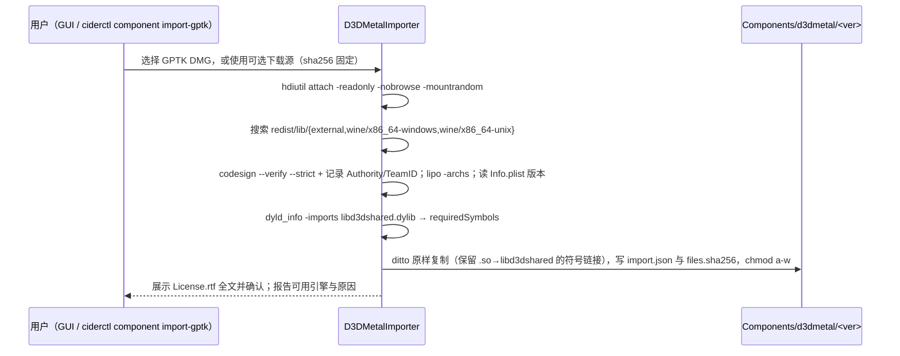

# 图形栈：DXMT / D3DMetal / wined3d / DXVK / MoltenVK / KosmicKrisp / vkd3d-proton

> 版本 v1 · 2026-09-27 · 依赖文档：`00-strategy-and-decisions.md`（ADR-001/002/003/004/006/010/011 为硬约束）、`01-architecture.md`（`GraphicsBackend`、配置分层、组件 schema、fallback 事件）、`05-app-cli-ux.md`、`06-profiles-recipes-compatdb.md`；调研 04、05、13、19、20、21 与 00-research-review（冲突以各报告“事实核查记录”和 00 号裁定为准）。下游：02、03、08、09、11、13。“窗”= 一个 5 小时配额窗口，1 人周 = 6 窗。

## 目标与范围（含明确不做的事）

**目标**
- G1 每个图形 API 都有确定的默认后端、白名单备选和门控，按 profile 自动选择；任何降级都在 UI 与会话日志写明原因码（原则 6），不重复 CrossOver FEX 构建的静默回退 [19 §6]。
- G2 D3D10/11 以 DXMT builtin 为主力，x86_64/i386 进 Engine R，arm64x 从 P0 起进 CI，P3 进入 Engine A。
- G3 D3D12 在 Engine R 上使用用户导入的 D3DMetal（GPTK 3/4），做到可校验、可多版本并存、宿主 ABI 可门控；开源路径（vkd3d-proton + KosmicKrisp）只跟踪、只做实验室 bring-up。
- G4 D3D8/9/DDraw 默认走 wined3d-GL，并用 remap 消除 32 位 GL 缓冲映射的影子拷贝；mtld3d、cnc-ddraw 按白名单启用。
- G5 统一管理着色器缓存、MetalFX 超分、限帧/VSync/VRR、HDR/EDR。
- G6 每个后端都有自动化测试（冒烟、轨迹回放、性能基准），按芯片档位设性能目标，并以 CX 26.3 oracle 为对照。
- G7 R3：HoYoverse 三款游戏（Unity + D3D11）的图形层可正当修复，门控条目的图形设置按 lint 锁定。

**范围**：后端矩阵、选择与物化、各组件的集成、构建、版本与贡献计划，以及测试与性能目标。Wine 补丁本身归 02，Engine A 宿主归 03，UI 归 05，数据 schema 归 06；本文只给规格与验收。

**明确不做**（ADR-006 与“不做清单”）
- 不做 DXVK-macOS（Gcenx 1.10.3），不 fork MoltenVK，不用带 shadow-import 的 MoltenVK 构建。
- 2027 年不自研 D3D12/D3D9 转译器（含自研 d9mt）、不发布 vkd3d-proton、不自修 KosmicKrisp B1（XFB）；B2 只在有余力时贡献。
- D3DMetal 不进仓库和主 bundle，不修改、不打补丁、不重签；不做“跨进程 D3DMetal”（arm64 Wine 远程调用 x86_64 宿主）[19 P2-10]。
- 默认 DX12 路径不依赖 `libmetalirconverter`（MSC EULA 原文未核对，只作将来的用户自装插件）[19 §5]。
- 门控条目（`anticheat.vendor=hoyoverse` 或 kernel 反作弊）不做 GPU 身份伪装、NVAPI stub、nvngx/DLSS 映射，也不提供解帧率等游戏修改 [21 §5]。
- 不在 VM 上做 GPU 正确性或性能结论 [13 §4.2]。

## 现状与关键事实

| # | 事实 | 来源 | 置信度 | 对设计的含义 |
|---|---|---|---|---|
| F1 | DXMT 最新 tag v0.80（2026-04-23），已有 32 位、D3D10、GS、mesh tessellation、磁盘缓存；main 在做 d3d12 与 arm64x（PR #209，09-17 合入）；构建需 LLVM 15 静态库、Xcode 16+ 与 Metal toolchain | [04 §3.1–3.2]、[19 §2.4] | 高 | 跟踪 main；LLVM 15 进 `deps-build` 缓存 |
| F2 | DXMT 经 `dlsym("macdrv_functions")` 取 Metal view，上游 winemac 不导出；该接口在 Wine 11.12/11.13 两次坏掉 | [04 §3.2]、[18 §2.3]、[19 §2.5] | 高 | 每次 rebase 必跑 DXMT 冒烟与符号断言 |
| F3 | D3DMetal 只支持 64 位 D3D11/12；framework（含 4.0b2）只有 x86_64 切片 | [04 §4 核查]、[19 §1.1] | 高 / 中高 | 只在 Engine R；32 位 D3D11 一律 DXMT |
| F4 | GPTK 3.0（Gcenx 构建 2025-12-05）、3.0-3（2026-03-03）；最新 4.0b2，无 RC/正式版；4.0b2 在 26.6.2 上只走 Metal 3，`D3DM_MTL4` 只在 27+ 生效且有时序 bug | [00 裁定 3]、[19 §1.2–1.3] | 中高（单人实测） | 多版本并存；26.5 须实测；27 默认关 MTL4 |
| F5 | D3DMetal 宿主契约：`macdrv_functions`（24 指针/192 B）、CW Hack 22434/22435、`d3dmetal_objc.m`；24067 须 `nm -u` 验证；GFXT 语义可复刻 | [02 摘要 核查]、[00 裁定 10] | 高 / 中 | 导入时记录未定义符号，与引擎导出做子集门控 |
| F6 | 上游 x86_64 unwinder 对非 PE 宿主库帧丢弃 personality routine，D3DMetal 的 C++ 异常可能中止 | [05 §1.3 核查] | 中（单一来源） | 先用最小用例证明必要 |
| F7 | D3DMetal 缓存在 `DARWIN_USER_CACHE_DIR/d3dm/<exe>/shaders.cache`，非稳定接口；GPTK 3→4 格式不兼容 | [13 §1.1、§1.4] | 高 / 低 | 按版本探测、快照恢复 |
| F8 | 上游 vkd3d-proton 在 KosmicKrisp 上有两个建设备硬阻塞：B1 XFB、B2 single-texel 对齐；截至 09-27 无任何 kk GS/XFB MR；Wine 内置 vkd3d 在 KK 上最多 FL11_0 | [19 §4、§8 核查] | 高 / 中 | 开源 D3D12 在 2027 年只做实验 |
| F9 | DXMT d3d12 仅 DXBC SM5.1，DXIL/GS/HS/DS/SO 为 `E_NOTIMPL`，FL≤11_1，标注 “DO NOT USE” | [19 §2] | 高 | 只跟踪（ADR-006 复议条件） |
| F10 | MoltenVK 1.4.2 无 GS/XFB，`robustBufferAccess2`/`nullDescriptor` 为 false；shadow-import 构建在 Wine 11 树上退化 | [05 §4 核查]、[20 §1.4] | 高 / 中 | 锁版本；只承载原生 Vulkan 与 wined3d-vk |
| F11 | KosmicKrisp 2026-09-25 宣布 Vulkan 1.4 一致性，仅 Apple Silicon + macOS 26+；缺 GS、`fillModeNonSolid`、XFB、sparse；RT 只有 Draft !43303 | [05 §5.2]、[19 §3] | 高 | 26+ 白名单 ICD |
| F12 | 上游 wined3d 在 Apple GL 与 MVK/KK 上 D3D10/11 上限约 FL9_3；CX 21 有打补丁 wined3d-vk 的先例 | [04 §1 核查]、[20 §3] | 中高（推断） | wined3d 不承担 D3D10/11 默认 |
| F13 | 上游 `wow64_map_buffer()` 在 macOS 上必走影子拷贝；CX 至少从 23.5.0 起用 `mach_vm_remap` 规避 | [20 §1.1–1.2 核查] | 高 / 中高 | `gl-remap` + 逐次计数 TRACE 断言 |
| F14 | HL2 Demo（M1 Pro）：Wine 10 引擎 38 fps（GL/Vulkan 相同），CX 26.3 树 131 fps，加 x87sidecar 174 fps，原因未明 | [20 §1.4 核查] | 中（单次测量） | 先复现再归因 |
| F15 | mtld3d（Rust、zlib）v0.11.0：SM1–3 + FFP、零拷贝、x86_64/aarch64 unix 库、有意偏离规范；neo773/d9mt 停滞；DXMT 无 D3D9 计划 | [20 §4 核查] | 高 | D3D9→Metal 跟随 mtld3d |
| F16 | Apple GL 4.1 在 26/27 无移除信号；Zink PE MR !10531 未合入，在 KK 上最多 GL 2.1 | [20 §6] | 高 / 中高 | OpenGL 只用 Apple GL |
| F17 | 插帧器与降噪超分需 macOS 26；DXMT 有开源 DLSS-SR→MetalFX；D3DMetal 用 `D3DM_ENABLE_METALFX` + nvngx-on-metalfx | [05 §8] | 高 | 超分按后端映射，插帧只跟踪 |
| F18 | Wine 10.20 起 EDR 余量 >1 即上报 HDR；DXMT 映射 PQ/scRGB；开发机 EDR 潜在值 16、ProMotion 24–120 Hz | [09 §5.4–5.5] | 高 | 需要“对游戏隐藏 HDR”；开发机可测 |
| F19 | 三款 HoYo 游戏均为 64 位 Unity D3D11；DXMT 特例支持 GPU skinning 的 SO；yaagl 0.3.19 修复星铁模型问题并把 DXMT 升到 `654f547`（归因为推断） | [21 §5 核查] | 中 | 三款默认 DXMT，门控 bottle 精确钉版本 |
| F20 | Metal 系统缓存按 bundle ID 分目录；GUI `posix_spawn` 的裸 Wine 进程共用顶层缓存 | [13 §1.1 核查]、[01 F4] | 中高 | T5（01）实测容量与抖动 |

## 设计

### 1 分层与组件

```
Cider.app / ciderctl
 └─ CiderKit.CiderGraphics（新模块，纯 Swift，CLT 可测）
     ├─ BackendRegistry        编译期注册 11 个后端（见 §2、§3）
     ├─ GraphicsResolver       ctx → GraphicsPlan：gate / fallbackChain / DXGI 家族 / 钳制
     ├─ Materializer           AppDefaults DllOverrides、Direct3D 注册表、env、DXMT_CONFIG、VK_DRIVER_FILES、overlay
     ├─ D3DMetalImporter       DMG 挂载、签名/切片/符号校验、原样复制
     └─ ShaderCacheManager     目录、版本隔离、快照、配额、命中率
Engine R 树（x86_64 Wine）：winemac.so（导出 macdrv_functions）、opengl32（remap）、wined3d、winevulkan、MoltenVK + Vulkan loader
Components/（签名清单）：dxmt、d3dmetal（导入）、mtld3d、cnc-ddraw、kosmickrisp
               ↓
Metal 3/4 · Apple GL 4.1（跑在 Metal 上）· MoltenVK / KosmicKrisp → Apple GPU
```

### 2 后端矩阵（ADR-006 落地）

| API | 默认 | 白名单备选 | Engine A（P3） | 门控要点 |
|---|---|---|---|---|
| D3D10/11（64 位） | `dxmt` | `d3dmetal`；`wined3d-vk`（仅 FL≤9_3 需求，P2 评估） | `dxmt`（arm64x） | d3dmetal：Engine R + x86_64 切片 + 已导入 + macOS ≥15 |
| D3D10/11（32 位） | `dxmt`（i386） | `wined3d-vk` | `dxmt` i386（由 FEX 模拟） | d3dmetal 恒不可用（`GFX_PE_32BIT`） |
| D3D12 | `d3dmetal`（仅 R） | `vkd3d`（Wine 内置，FL11_0，KosmicKrisp，26+） | `route:R` | 无可用后端时弹卡片，不静默 |
| D3D8/9 | `wined3d-gl` + remap | `mtld3d`；`wined3d-vk`（实验） | `wined3d-gl` / `mtld3d`（aarch64 unix 库） | mtld3d 只按 profile 白名单 |
| DDraw、D3D1–7 | `wined3d-gl` | `cnc-ddraw`；`wined3d-no3d` | 同 R | cnc-ddraw 只用于 2D |
| OpenGL | `apple-gl` | —（Zink 只跟踪） | `apple-gl`（arm64） | 请求 >4.1 时给出说明 |
| Vulkan | `moltenvk`（锁定版本） | `kosmickrisp` | 同 R | KK：macOS ≥26、Apple GPU |

静态 fallbackChain：`d3dmetal→dxmt`（仅 D3D10/11）；`dxmt→wined3d-gl`（仅组件缺失时）；`mtld3d→wined3d-gl`；`wined3d-vk→wined3d-gl`；`cnc-ddraw→wined3d-gl`；`kosmickrisp→moltenvk`；`vkd3d→∅`；D3D12 的 `d3dmetal→vkd3d（仅白名单）→∅`。“∅”表示禁用该 DLL 并弹卡片（§7.6）。

### 3 接口

扩展 01 的 `GraphicsBackend`（01 §10），新增描述符与原因码：

```swift
public enum GfxAPI: String, Codable, CaseIterable { case ddraw, d3d8, d3d9, d3d10, d3d11, d3d12, opengl, vulkan }
public enum DXGIFamily: String, Codable { case wine, dxmt, d3dmetal, none }
public struct BackendDescriptor: Codable, Sendable {
  public let id: String                 // "dxmt" | "d3dmetal" | "wined3d-gl" | "wined3d-vk" | "wined3d-no3d" | "mtld3d" | "cnc-ddraw" | "vkd3d" | "apple-gl" | "moltenvk" | "kosmickrisp"
  public let apis: Set<GfxAPI>
  public let dxgi: DXGIFamily           // 提供 dxgi.dll 的家族；d3d9/ddraw 类为 .none
  public let provides: [String]         // PE DLL：["d3d11","dxgi","d3d10core","winemetal","nvapi64","nvngx"]
  public let peArchs: Set<PEArch>       // .x86_64 .i386 .arm64x .aarch64
  public let engines: Set<EngineFlavor> // .R .A
  public let minMacOS: String, minGPUFamily: String   // "14.0", "apple7"（M1）
  public let component: String?         // nil = 引擎内置
  public let maturity: Maturity         // .default .whitelist .experimental .labOnly
}
public protocol GraphicsBackend: Sendable {
  var descriptor: BackendDescriptor { get }
  func gate(_ c: GateContext) -> GateResult               // .ok | .fail(GfxReason, detail: String)
  func materialize(_ e: inout LaunchEnv, _ p: GraphicsPlan, _ b: Bottle) throws
}
public struct GateContext: Sendable {
  public let host: HostCaps          // macOS、gpuFamily、metal4、edrHeadroom、ramGB（来自 cider-probe）
  public let engine: EngineManifest  // flavor、arch、capabilities.d3dmetalHost、exports 摘要
  public let components: InstalledComponents
  public let app: AppFacts           // peArch、primaryAPI、gating（anticheat/drm）
}
```

| 原因码（`fallback.reason`） | 含义（zh-Hans 文案键 `gfx.reason.*`） |
|---|---|
| `GFX_D3DM_NOT_IMPORTED` | 未导入 GPTK |
| `GFX_D3DM_ARCH` | 缺所需切片（R 需 x86_64，A 需 arm64，不接受仅 arm64e） |
| `GFX_D3DM_HOST_ABI` | libd3dshared 的未定义符号不在引擎导出集中 |
| `GFX_D3DM_INTEGRITY` | 签名或文件树哈希与导入记录不符 |
| `GFX_OS_TOO_OLD` / `GFX_GPU_FAMILY` | 系统或 GPU 家族低于后端下限（如 DXR 需 apple9） |
| `GFX_ENGINE_FLAVOR` / `GFX_PE_32BIT` | 当前引擎或位数不支持该后端 |
| `GFX_COMPONENT_MISSING` | 组件未装，或 `compat.engines` 不覆盖当前引擎 |
| `GFX_NOT_WHITELISTED` | 白名单后端未被 profile 列入 |
| `GFX_DXGI_CONFLICT` | 与主 API 的 DXGI 家族冲突 |
| `GFX_POLICY_CLAMP` | 门控条目的策略钳制 |

`ConfigKey` 注册（导出到 `schemas/config-keys.json`，供 06 lint 使用）：

| 键 | 取值 | 作用域 | restartScope |
|---|---|---|---|
| `graphics.{d3d11,d3d12,d3d9,ddraw,opengl,vulkan}` | 后端 id；`d3d12` 另可取 `route:R` | 全局/bottle/程序/profile | session |
| `graphics.legacy` | 05 已用的别名，展开为 `d3d9`+`ddraw` | 同上 | session |
| `graphics.d3dmetal.version`、`.mtl4`、`.dxr` | `"3.0-3"`；bool；bool（apple9+） | 程序/profile | session |
| `graphics.metalfx` | `off` / `spatial` / `dlss` | 程序/profile | session |
| `graphics.frame_limit`、`graphics.vsync` | 0 或 fps；`app`/`on`/`off` | 程序/profile | session |
| `graphics.hdr` | `auto` / `hide` | 程序/profile | session |
| `graphics.gpu_identity`、`graphics.nvapi_stub` | `honest`/`nvidia`/`amd`；bool | 程序/profile（门控条目钳制） | session |
| `graphics.shader_cache` | `on` / `off` | 程序 | session |
| `display.retina` | bool（同时设 `LogPixels=192`） | 仅 bottle | wineserver |

06 的 `when` 可用事实：`gfx.d3dmetal.{version,archs,imported}`、`gfx.dxmt.version`、`gfx.kosmickrisp.available`、`host.gpu_family`、`host.metal4`。

### 4 自动选择算法

```text
resolveGraphics(ctx):
  primary = profile.api ?? gameDB.api ?? PEAPIScanner(exe, gameDir) ?? d3d11
      # 扫描 exe 与同目录 DLL 的导入表：d3d12/dxgi+D3D12CreateDevice > d3d11 > d3d9 > opengl32 > vulkan-1 > ddraw
  for api in GfxAPI.allCases:
      wanted = L5 ?? profile.renderer[api] ?? L3 ?? L2 ?? L1 ?? engine.defaults[api]
      pick = first([wanted] + fallbackChain(api, wanted),
                   where: b.gate(ctx) == .ok && (b.maturity != .whitelist || profile allows b))
      if pick != wanted: fallbacks += {key: "graphics."+api, wanted, got: pick, reason}
  fam = plan[primary].dxgi                                  # DXGI 家族由主 API 决定
  for api in [d3d10, d3d11, d3d12] where plan[api].dxgi ∉ {fam, none}:
      plan[api] = sameFamily(api, fam) ?? .disabled          # dxmt 家族下 d3d12 → 禁用，让游戏的 DX12 探测快速失败
      fallbacks += {…, reason: GFX_DXGI_CONFLICT}
  clamp(ctx.app.gating)          # hoyoverse：renderer 取 Verdict 记录值；gpu_identity=honest；nvapi/nvngx/NVEXT 关；DXMT_CONFIG 的 dxgi.* 拒绝
  if primary == d3d12 && plan[d3d12] == .disabled: emit RouteHint(needsD3DMetal, dx11Args: profile.dx11_args)
  return GraphicsPlan(plan, family, env, overrides, fallbacks, clamps)
```

- 选择按 exe 物化（AppDefaults），同一 bottle 里的启动器（CEF → ANGLE D3D11）和游戏可以落在不同家族。
- 运行时失败不自动换后端：会话退出后 DiagRule 命中 `GFX_DEVICE_FAIL`（如 `D3D11CreateDevice failed`、DXMT/D3DM 日志签名），只给“用 X 重试一次”的建议卡（05 §10）；门控条目只给路线卡。
- 会话清单 `session.json` 的图形块示例：

```json
"graphics": {
  "primaryApi": "d3d12", "dxgiFamily": "d3dmetal",
  "plan": {"d3d11": "d3dmetal", "d3d12": "d3dmetal", "d3d9": "wined3d-gl", "ddraw": "wined3d-gl",
           "opengl": "apple-gl", "vulkan": "moltenvk"},
  "components": {"d3dmetal": "3.0-3"},
  "env": {"D3DM_ENABLE_METALFX": "1"},
  "fallbacks": [{"key": "graphics.d3dmetal.version", "wanted": "4.0b2", "got": "3.0-3",
                 "reason": "GFX_OS_TOO_OLD", "detail": "profile 限定 4.0b2 需 macOS >=26.6"}],
  "clamps": [], "provenance": {"graphics.d3d12": "profile:profile.umu-990080@3"}
}
```

### 5 物化

| 对象 | 机制 | 作用域 |
|---|---|---|
| PE DLL 选择 | cider-rules 写 `HKCU\Software\Wine\AppDefaults\<exe>\DllOverrides`（如 `d3d11,dxgi,d3d10core=b`、`d3d12=`） | 每个 exe |
| 组件文件 | `CIDER_DLL_OVERLAY=<Components/x/ver>/wine`（02 的 `cider-integration` 小补丁，builtin 与 unixlib 查找都排在引擎目录之前）；在它通过验证前，DXMT 退回到引擎内置的那一份 | 会话 |
| wined3d | `AppDefaults\<exe>\Direct3D\renderer = gl / vulkan / no3d`；`WINE_D3D_CONFIG` 只用于诊断 | 每个 exe |
| DXMT 选项 | `DXMT_CONFIG="d3d11.preferredMaxFrameRate=60;d3d11.maxTessFactor=16"`、`DXMT_SHADER_CACHE_PATH`（必须以 `/` 开头的 Darwin 路径 [13 §1.1]） | 会话 |
| D3DMetal | `CX_APPLEGPTK_LIBD3DSHARED_PATH`（22434 读取；保留原名以减少 ABI 分叉）、`D3DM_*` | 会话 |
| Vulkan ICD | `VK_DRIVER_FILES=<icd.json>`；`MVK_CONFIG_*` | 会话 |
| cnc-ddraw | recipe `copy_dll` 把 `ddraw.dll` 和 `ddraw.ini` 写到游戏目录，并设 `ddraw=n,b`（只用于非门控条目） | 每个游戏 |
| GPU 身份 | wined3d：`Direct3D\VideoPciVendorID/DeviceID`；DXMT：`dxgi.customVendorId`；NVAPI：`DXMT_ENABLE_NVEXT=1` | 每个 exe（门控条目禁用） |

### 6 D3D10/11：DXMT

- **集成**：以 `-Dwine_builtin_dll=true` 针对 Engine R 的 Wine 头文件构建。PE 为 `d3d11`、`dxgi`、`d3d10core`、`winemetal`、`nvapi64`、`nvngx`（x86_64 + i386，用 mingw-w64 gcc，遵守 ADR-004），unix 侧为 `winemetal.so`（`clang -arch x86_64`，Rosetta 下运行，含 airconv）。发布为组件，`compat.engines` 覆盖同一 Wine 次版本线；引擎内再带一份默认版本作为 overlay 的兜底。
- **Wine 依赖**：`winemac.so` 导出 `macdrv_functions`（DXMT 与 D3DMetal 共用，建议 02 放进 `winemac` 主题，而不只放在 `d3dmetal-abi`）；D3DKMT 共享资源需要 Wine ≥10.18。CI 断言：`nm -gU lib/wine/x86_64-unix/winemac.so | grep -q _macdrv_functions`。
- **版本**：组件号为 `<tag>.<n>+g<sha>-c<k>`，例如 `0.80.14+g654f547-c1`。初始候选是 main 上不早于 `654f547` 的提交（包含星铁模型修复 [21 §5]），实验室不通过则退回 v0.80。每月评估一次，或在关键修复出现时评估；每次升级都要跑 §测试中的 DXMT 套件与 HoYo 回放。`guard=hoyoverse` 的 bottle 按 Verdict 精确钉版本，改版本须先经实验室复核。
- **arm64x**：P0 起 CI 用 llvm-mingw `arm64ec-w64-mingw32` + `-marm64x`，产出 ARM64X PE 和 `-arch arm64` 的 `winemetal.so`，只作为产物，P3 由 03 接入 Engine A。
- **fork 策略**：默认不 fork。只有这两项在 08 的日志证实需要时，才开 `cider-dxmt`（≤5 个补丁，每个都附上游 PR）：跨进程 swapchain 的 opt-in（Highball 的 `DXMT_ALLOW_CROSS_PROCESS_SWAPCHAIN`）、`SwapDeviceContextState` [18 §2.3]。
- **向上游贡献**（计入 ADR-004“每月 ≥2 个上游 MR”）：① 每周用 Wine devel tag 构建 DXMT main，接口坏了当天报给上游（先例：11.12/11.13）；② Engine A 上的 arm64x 运行测试；③ Unity GPU skinning 的 SO 用例与轨迹（对应 #28 与 1.0 计划）；④ 呈现路径接入 `CAMetalDisplayLink` 做 VRR 节拍；⑤ HDR 与 `forceSDR` 相关修复；⑥ 在用户同意后导出实验室兼容数据给 dxmt.report。

### 7 D3D12

**7.1 D3DMetal 导入流程**（一行许可约束：D3DMetal 不能提交进仓库或默认随包，因此默认由用户从 GPTK 导入；可选源只提供原样 framework，也经国内镜像按 sha256 分发，对应 ADR-006/012）



`import.json` 示例：

```json
{"schemaVersion": 1, "kind": "d3dmetal", "version": "4.0b2", "bundleVersion": "<CFBundleVersion>",
 "source": {"type": "user-dmg", "dmgSha256": "…", "importedAt": "2026-10-20T10:00:00Z"},
 "codesign": {"valid": true, "authority": ["Apple Development…", "…"], "teamId": "…"},
 "archs": {"D3DMetal.framework": ["x86_64"], "libd3dshared.dylib": ["x86_64"]},
 "requiredSymbols": {"winemac.so": ["_macdrv_functions"], "ntdll.so": ["…"]},
 "tree_sha256": "…", "license": "License.rtf", "modified": false}
```

- **校验规则**：签名要求表达式在第一次真实导入后固化（`anchor apple` 还是 `anchor apple generic` + TeamID，见未决问题）；只在验签通过后去掉 `com.apple.quarantine` xattr（不改变签名内容）；每次会话前抽检 `tree_sha256`（带 mtime 缓存），不符即 `GFX_D3DM_INTEGRITY`。`nvngx.dll` 以符号链接指向 `nvngx-on-metalfx.dll`，原文件不改名。
- **宿主 ABI 门控**：`engine-build` 用 `nm -gU` 生成 `ntdll.so`、`winemac.so` 的导出清单，写入 manifest（`capabilities.d3dmetalHost: "gfxt-1"` 加 `exports.sha256`）。gate 检查 `requiredSymbols ⊆ exports`，否则报 `GFX_D3DM_HOST_ABI`。宿主层按 GFXT 语义实现、与架构无关（ADR-006），这样出现 arm64 切片时只需补 03 的胶水。
- **版本策略**：

| macOS | 默认 | 按游戏（profile） | 说明 |
|---|---|---|---|
| 14.x | 不可用 | — | `GFX_OS_TOO_OLD`（ADR-001：GPTK 3 需 15+） |
| 15.x | 3.0-3 | — | 4.x 未验证 |
| 26.x | 3.0-3 | 4.0b2（例如 UE ≥5.6 的 sampler heap 断言 [19 §1.2]） | 4.0b2 在 26.5 上的结论由 GFX-08 给出 |
| 27.x | 4.0b2 + `D3DM_MTL4=0` | `D3DM_MTL4=1` 白名单；3.0-3 作回退 | GPTK 4 正式版出现后重评（T2） |
| 28.x | 由 G-T15/G-WWDC 决定 | — | 不可用时 UI 说明，DX12 路由到 ≤27 |

- `D3DM_SUPPORT_DXR=1` 只在 `host.gpu_family ≥ apple9`（M3 起）时允许；`ROSETTA_ADVERTISE_AVX` 归 02/07。
- **unwinder**：GFX-08 写“C++ 异常穿过宿主库帧”的最小 PE + dylib 用例，确认必要后再由 02 放进 `d3dmetal-abi` [05 §1.3]。

**7.2 开源路径（vkd3d-proton + KosmicKrisp）：只跟踪 + 实验室 bring-up**

| 阻塞 | 内容 | Cider 在 2027 年的动作 |
|---|---|---|
| B1 | XFB（`transformFeedbackQueries`） | 不自修（ADR-003/不做清单）；T0（09-30）看 XDC 演讲，联系 LunarG 确认归属；提供 Apple 硬件上的 CTS 子集运行与回报 |
| B2 | single-texel 对齐（M3 实测 16 B） | 条件包 C1：有余力且无人认领时贡献 NIR 偏移 lowering |
| B3/B8 | GS、`fillModeNonSolid` | 跟踪（B3 与 B1 同属 libpoly 接线） |
| B4–B7 | sparse、DXR（!43303）、mesh、ROV/保守光栅化 | 跟踪；bring-up 报告统计各项对游戏的影响 |

- **watcher**：`watchers` 工作流每周查询 `gitlab.freedesktop.org/api/v4/projects/176/merge_requests?labels=KosmicKrisp&state=all`（REST API 不受 Anubis 影响），有 GS/XFB/single-texel/!43303 的变化就自动开 issue。
- **内部 bring-up**：只在 `cider-lab`。给 vkd3d-proton 打“跳过 B1/B2 检查”的补丁，用 `--build-arm64x` 与 x86_64 两种构建，跑它自带的测试和 20 款 DX12 游戏，输出按 B3–B8 分类的失败分布。**不发布**，也不进任何引擎或组件索引。
- **复议点**：B1+B2 进入 Mesa main 后，评估“未打补丁的 vkd3d-proton 能否建设备”；若能，在 G-WWDC 提交 ADR-006 复议（发布与否由 ADR 决定）。

**7.3 Wine 内置 vkd3d（FL11_0）**：只在 macOS ≥26、ICD 为 KosmicKrisp、profile 白名单时启用。先实测设备能否创建、实际报出的 FL/SM，并建一份“最低只要 FL11_0 且不用 GS/SO”的候选清单 [19 P1-6]。

**7.4 DXMT d3d12**：每月读一次 `src/d3d12` 的提交与 README；作者去掉 “DO NOT USE” 时启动条件包 C3，只对 FL11 + SM5.1 的白名单游戏开放，优先用于 Engine A。

**7.5 Engine A**：没有 arm64 D3DMetal 时，D3D12 游戏的 bottle 写 `graphics.d3d12: "route:R"`，由 03 做 R 路由，UI 标明“依赖 Rosetta”。G-WWDC 通过（GPTK 出现 arm64 切片）后启动条件包 C2。导入器已经分开记录 `arm64` 与 `arm64e`，只有 arm64e 的切片无法被第三方 arm64 进程加载 [19 §1.1]。

**7.6 没有 D3DMetal 时的 DX12 体验**：卡片给三个选项：①导入 GPTK（附中文步骤与可选下载源）；②若 profile 提供 `dx11_args`（如 `-dx11`），以 DX11 模式经 DXMT 启动；③查看说明。这时 `d3d12.dll` 被禁用，不走任何残缺路径。

### 8 D3D8/9/DDraw 与 32 位

- **wined3d-GL + remap（默认）**：`gl-remap` 主题（02）移植 CX 的 `mach_vm_remap` 分支，位置在 `vk_memory`、`pinned`、“we're lucky”之后，`GL_MAP_PERSISTENT_BIT` 失败与影子缓冲之前 [20 P0-1]。Cider 在影子缓冲分支加一条每次命中都打印、带累计计数的 `TRACE("cider-shadow-copy n=%u")`，CI 用 `WINEDEBUG=+opengl` 跑 `glmap32.exe`，要求计数为 0。另审计别名回收：删除缓冲时 `mach_vm_deallocate` 别名区；10 万次 map/unmap 后虚拟地址增长 <16 MB（保护 LAA 游戏）。单游戏开关 `HKCU\Software\Wine\OpenGL\CiderRemap=N` 可退回拷贝路径。
- **老游戏 A/B 基准**（GFX-11）：在 M3 上复现 HL2 Demo timedemo（1280×720，trainstation），每种配置跑 3 次取中位数：上游 11.18、11.18+remap、11.18+msync、Cider 全补丁、CX 26.3 oracle；同时采集 `+fps`、Rosetta 线程占比和缺页数，给 38→131 fps 的差距归因 [20 P0-2]。
- **cnc-ddraw**：MIT 组件，只用于 2D DirectDraw，按 profile 启用；D3D1–7 的 3D 游戏不用它。
- **mtld3d（白名单）**：固定 tag（初始 v0.11.0），CI 跑它自带的 154 项测试；带 `x86_64-unix` 与 `aarch64-unix` 两份 `mtld3d.so`，经 overlay 加载。它有意偏离规范（如每次 Present 丢弃深度），所以只按游戏白名单启用，profile 可一键回退。与作者协作，不 fork。
- **wined3d-vk**：P2 在 KosmicKrisp 上评估 20 款 D3D9 游戏，这条路径在 WoW64 下零拷贝（`VK_EXT_map_memory_placed`）[20 §3]，只作实验选项。
- **x87sidecar**：1.0 后的实验组件（ADR-006），cooperative 模式，启动前 `--probe`，失败自动关闭；macOS 28 的游戏模式会禁用 Rosetta，所以只是 26–27 上的短期收益 [20 §2]。
- **DXVK-macOS**：不构建、不分发。理由：2024 年后无人维护，repack 删掉了 d3d9/dxgi；在 Wine 11 树 + MoltenVK 1.4.2 上出现退化与故障 [04 §2.3]、[20 §1.4]。上游 DXVK 3.x 等 KosmicKrisp 同时补齐 GS 与 `fillModeNonSolid` 后再评估（2028+，走 ADR 复议）。
- **长期 D3D9→Metal**：2027 年跟随 mtld3d，不自研。2027-Q4 评估：若 mtld3d 仍活跃，且在实验室 D3D9 集上首帧通过率 ≥ wined3d-GL、性能中位数 ≥1.3 倍，就提议把它从白名单扩为“按游戏默认”；若它停滞 ≥90 天，则比较两条路：接手 mtld3d 维护，或以 Sikarugir d9mt `dx9` 分支（athei 的 DXSO→AIR）在 DXMT 框架内继续，交由 ADR 复议。D3D8 跟随 mtld3d 的 D3D8 计划。

### 9 OpenGL 与 Vulkan

- **OpenGL**：winemac → Apple CGL 4.1 core / 2.1 legacy，32 位走 remap。游戏请求 >4.1 的上下文时，由 DiagRule `GL_VERSION_UNSUPPORTED` 识别（匹配 winemac 的 `wglCreateContextAttribsARB` 失败日志），给出明确说明，不静默失败。Zink（!10531）每季度看一次，直到 KosmicKrisp 具备 `fillModeNonSolid`、XFB 与 GS。
- **Vulkan 运行时**：引擎内带 Khronos loader（从 tag 构建，universal）和 MoltenVK。MoltenVK 先锁 1.4.1；不带 shadow-import 的原版 1.4.2 过实验室 Vulkan 集后才换；带 shadow-import 的构建在 Highball #198 修复前一律不用 [20 P1-9]。经 loader 使用 MoltenVK 需要 winevulkan 设置 portability enumeration（02 核实上游是否已有）。KosmicKrisp 为组件：`deps-build` 从 Mesa release tag 构建 universal `libvulkan_kosmickrisp.dylib`（LLVM ≥20.1.8、meson ≥1.9.1，另一份缓存）加 ICD JSON，门控为 macOS ≥26、apple7+。`MESA_KK_EXPERIMENTAL` 只在实验室使用。
- **原生 Vulkan 游戏**：默认 MoltenVK，profile 白名单切 KosmicKrisp；用到 GS/XFB/RT/mesh 的游戏预期失败，profile 优先提供 `-dx11` 类参数。

### 10 超分与插帧

| 能力 | DXMT | D3DMetal | wined3d / mtld3d | 门控条目 |
|---|---|---|---|---|
| DLSS-SR → MetalFX | `DXMT_ENABLE_NVEXT=1`（需 nvapi） | `D3DM_ENABLE_METALFX=1` + nvngx 链接 | — | 禁用（RL-SPOOF） |
| 空间超分（游戏无感） | `DXMT_METALFX_SPATIAL_SWAPCHAIN=1` + `d3d11.metalSpatialUpscaleFactor` | — | mtld3d 自带 MetalFX（跟随上游） | 只按 Verdict 开启 |
| 插帧 | 不做（`MTLFXFrameInterpolator` 需要运动矢量与深度，没有通用 swapchain 插帧） | 跟踪 GPTK 是否把 DLSS-FG 映射到插帧器 [05 §8，低] | — | — |

- UI 只给一个“超分”下拉（关 / 空间 / DLSS），由 `graphics.metalfx` 映射到各后端；8 GB 档的预设建议打开空间超分。FSR/XeSS 是游戏自带着色器，无需处理。开放 D3D12 路径的 nvngx shim 等 §7.2 有结论后再说。

### 11 着色器缓存

```
~/Library/Caches/Cider/shaders/<bottle>/<app>/
  dxmt-<ver>/shaders_<metal>.db        # DXMT_SHADER_CACHE_PATH 指向此处（Darwin 绝对路径）
  d3dm-<ver>/snapshot/<exe>/…          # D3DMetal 缓存快照（原位置仍在 DARWIN_USER_CACHE_DIR/d3dm/<exe>）
  stats.json                           # 每次会话的 HUD 编译事件数与 cached=0 比例
```

- D3DMetal：会话结束时，如果缓存增长且会话 ≥10 分钟，就快照一次；启动前如果原位置缺失或体积小于快照的 50%，就从快照恢复。快照键为 exe × D3DMetal 版本 × macOS build × GPU 家族，换版本时旧快照隔离，不复用（GPTK 3→4 格式不兼容）。找不到目录时降级为“只清理”。
- Metal 系统缓存：Wine 进程都是裸二进制，共用顶层 `com.apple.metal`。T5（01）测出命中率 <50% 或出现抖动时，采用 01 的预案（给每个引擎设独立的 loader `CFBundleIdentifier`）。
- 配额：默认 10 GB，按最近会话时间做 LRU；bottle 导出与快照都排除缓存；UI 提供“清理/重建着色器缓存”（05）。
- 1.0 之后研究：在 DXMT 中采集“DXBC hash + 管线状态键”作为 pipeline 配方，随 profile 分发，由客户端在空闲时低 QoS 预编译 [13 P2-13]。

### 12 显示：HDR/EDR、VRR、帧节奏、限帧

- **HDR**：`graphics.hdr=auto` 时沿用 Wine 的 EDR 上报；设为 `hide` 时，由 winemac 补丁读取 `HKCU\Software\Wine\Mac Driver\CiderHideHDR=Y`，让 `hdr_enabled=false`，DXMT 另设 `dxgi.forceSDR=true`。D3DMetal 在外接 HDR 显示器上报 SDR 是已知缺陷，只做记录 [05 §1.2]。
- **限帧与 VSync**：统一键 `graphics.frame_limit`。DXMT 用 `d3d11.preferredMaxFrameRate`；D3DMetal 在 Cider 自有的 `WineMetalLayer -nextDrawable`（`d3dmetal_objc.m`）里按截止时间 `mach_wait_until` 节拍，不触碰 D3DMetal；wined3d-GL 在 winemac 的 swap 路径做同样处理；mtld3d 视其呈现路径决定（待核）。`graphics.vsync=off` 映射到 `CAMetalLayer.displaySyncEnabled=NO`（winemac 补丁）。
- **VRR**：ProMotion 上用 `CAMetalDisplayLink` 的 `preferredFrameRateRange` 做节拍，先作为 DXMT 上游贡献（P4），在开发机 24–120 Hz 屏上验收。
- **Retina**：bottle 级 `RetinaMode` + `LogPixels=192`，8 GB 档默认关（07）。报告给游戏的显存以 `recommendedMaxWorkingSetSize` 为基数（07）；门控条目保持后端默认值。

### 13 仓库与构建

```
cider/engine/components/{dxmt,mtld3d,cnc-ddraw,kosmickrisp}.yaml   cider/engine/deps/{llvm15,llvm20,vulkan-loader,moltenvk}.yaml
cider/Packages/CiderKit/Sources/CiderGraphics/{Registry,Resolver,Materializer,D3DMetalImporter,ShaderCache}/…
cider/Tools/gfx-smoke/{d3d11-tri,d3d9-tri,glmap32,d3d12-dev,vk-tri,unwind-probe}/   # mingw 构建的测试 PE
cider-lab/{traces/public,traces/private,bench,bringup/vkd3d-proton}/
```

```yaml
# engine/components/dxmt.yaml
id: dxmt
source: { repo: https://github.com/3Shain/dxmt, commit: 654f547…, tag_base: v0.80 }
requires: { deps: [llvm15-x86_64, llvm15-arm64, mingw-w64-gcc, llvm-mingw], xcode: ">=16", meson: ">=1.3" }
builds:
  - { flavor: R, pe: [x86_64, i386], pe_toolchain: mingw-w64-gcc, unix_arch: x86_64, meson_args: ["-Dwine_builtin_dll=true"] }
  - { flavor: A, pe: [arm64x], pe_toolchain: llvm-mingw, cross_file: build-arm64ec.txt, unix_arch: arm64, publish: false }
checks: [ "nm -gU $ENGINE/lib/wine/x86_64-unix/winemac.so | grep -q _macdrv_functions", "gfx-smoke d3d11-tri --backend dxmt" ]
compat: { engines: ">=11.18-c1 <12.1" }
```

## 实施计划 — WBS

| 编号 | 工作包 | 产出 | 验收标准 | 估时（人周） | 依赖 | 阶段/里程碑 |
|---|---|---|---|---|---|---|
| GFX-01 | 图形工具链 | 开发机装 Xcode 26.x + Metal toolchain（与 12 共用）；`deps-build` 缓存 LLVM 15（x86_64/arm64）、mingw-w64 gcc、llvm-mingw、meson | 冷构建 ≤90 分钟，命中缓存 ≤5 分钟；产物 sha256 固定 | 0.4 | 11、12 | P0 第 1–2 周 |
| GFX-02 | DXMT 组件（R） | `dxmt.yaml`、x86_64+i386 PE、`winemetal.so`、component.json、`d3d11-tri` | M3 上 64/32 位样例出首帧；`macdrv_functions` 断言接入 rebase 门禁 | 0.8 | 01、02 | P0 → **M-A** |
| GFX-03 | DXMT arm64x CI | ARM64X PE + arm64 `winemetal.so` 产物（不发布） | 每次 DXMT 升级都生成；`llvm-readobj` 显示 ARM64X | 0.2 | 02 | P0 |
| GFX-04 | 后端抽象与解析器 | `CiderGraphics` Registry/Resolver、原因码、explain | ≥60 条 golden（钳制、DXGI 冲突、无 D3DMetal 的 DX12）；解析 <2 ms | 0.8 | ARC-03 | P0（0.4）→ P1（0.4） |
| GFX-05 | 物化器与 overlay | DllOverrides、Direct3D 注册表、env、ICD、`CIDER_DLL_OVERLAY` 实测 | 假 wine 桩验证输出；真引擎上同一 bottle 启动器走 wined3d、游戏走 DXMT | 0.5 | ARC-11、02 | P1 |
| GFX-06 | PE API 扫描 | 导入表 + 同目录 DLL 推断 primaryApi | 50 个标注样本准确率 ≥90% | 0.3 | CiderPE | P1 |
| GFX-07 | D3DMetal 导入器 | 导入器、`import.json`、可选下载源、`ciderctl component import-gptk` | 3.0、3.0-3、4.0b2 导入成功；改 1 字节即被拒；R 与 A 的可用性和原因正确 | 0.5 | 05 APP-05 | P0 末 → P1 |
| GFX-08 | D3DMetal 宿主验收 | `d3d12-dev`（设备创建、`CheckFeatureSupport` 转储）、`unwind-probe`、符号子集门控 | 26.5 上 3.0-3 的 D3D11/12 通过；4.0b2 的结论写入 profile gate；unwind 用例区分有无补丁 | 0.6 | 02 `d3dmetal-abi` | P1 → **M-B** |
| GFX-09 | D3DMetal 版本与缓存 | 版本策略表落地、MTL4 白名单、d3dm 快照/恢复 | 27 上默认 `MTL4=0`；恢复后第二次启动 `cached=0` ≤5% | 0.4 | 07 | P2 |
| GFX-10 | 32 位 GL remap 验收 | `glmap32`、TRACE 计数断言、VA 泄漏测试 | 影子缓冲计数 = 0（P1 退出标准）；VA 增长 <16 MB | 0.4 | 02 `gl-remap` | P1 |
| GFX-11 | 老游戏 A/B 基准 | 6 款 × 5 配置 × 3 次 | 38→131 fps 被复现或否定并有归因报告；Cider ≥ oracle 的 90% | 0.6 | 11 | P2 |
| GFX-12 | cnc-ddraw | 组件 + 20 款 2D 游戏 profile | ≥16 款窗口化与缩放正常 | 0.3 | 06、ARC-14 | P2 |
| GFX-13 | mtld3d 白名单 | 固定 tag、154 项测试、10 款白名单 | 测试全过；白名单游戏首帧 + SSIM 通过；可一键回退 | 0.5 | 11 | P3 |
| GFX-14 | Vulkan 运行时 | loader + MoltenVK 锁定版 + portability；KosmicKrisp 组件 | `vk-tri` 在两种 ICD 上出帧；26 以下 KK 置灰并给原因 | 0.7 | 02 | P2 |
| GFX-15 | 开放 DX12 跟踪 | REST watcher（P1 0.1）、vkd3d-proton bring-up 与失败分布（P3） | 每周自动 issue；20 款 DX12 游戏按 B3–B8 分类 | 0.8 | 11 | P1 → P3 |
| GFX-16 | vkd3d FL11_0 白名单 | 设备创建、FL/SM 实测、候选清单 | 报告出炉；白名单 ≥1 款，或结论为“不启用” | 0.3 | GFX-14 | P3 |
| GFX-17 | 超分 | `graphics.metalfx` 映射、门控钳制 | 3 款游戏的 DLSS 选项出现并生效；门控条目看不到该开关 | 0.4 | 05、06 | P2 → M-C |
| GFX-18 | 帧节奏 | 统一限帧、VSync（P2 0.5）；CAMetalDisplayLink 上游贡献（P4 0.5） | 限 30/40/60 时 p95 帧间隔偏差 ≤1 ms（DXMT、D3DMetal、wined3d-GL 各 1 款）；ProMotion 上 48 fps 平滑 | 1.0 | 02 | P2、P4 |
| GFX-19 | 着色器缓存管理器 | 目录、版本隔离、配额、统计 | 暖启动编译事件数 ≤ 冷启动的 10%；导出不含缓存 | 0.5 | 05、07 | P2 |
| GFX-20 | HDR/EDR | `hide` 开关（P2 0.2）、EDR 测试图与外接屏记录（P4 0.2） | 开发机 XDR 上 PQ 测试图亮度正确；隐藏后游戏不再默认开 HDR | 0.4 | 02、07 | P2、P4 |
| GFX-21 | 测试套件与轨迹回放 | `cider-trace`、WARP 基准图、公开/私有轨迹集、按后端夜跑 | 公开集 ≥30 条轨迹；单后端 PR 门禁 ≤20 分钟 | 1.2 | 11 | P1（0.2）→ P2（1.0） |
| GFX-22 | 性能框架与档位目标 | HUD 日志解析、3 次中位、oracle 对照、月报 | 下文性能表的指标全部可自动出数 | 0.6 | 11 | P2 |
| GFX-23 | HoYo 图形配置（与 09） | 三款默认 DXMT、SO 与模型轨迹、8 GB 预设、钳制用例 | 实验室三款首帧正常、无隐形角色；原神 M3 8 GB 60 秒平均 ≥45 fps（目标值，首测后校准） | 0.4 | 09 | P2 |
| GFX-24 | GPU 身份与 NVAPI stub | 非门控条目按游戏配置 | CS:GO Legacy 用例能进图；门控条目被 lint 拒绝 | 0.3 | 06 | P2 |
| GFX-25 | OpenGL 边界 | `GL_VERSION_UNSUPPORTED` DiagRule 与文案 | 3 款 GL 4.3+ 程序都给出说明 | 0.2 | 06 | P2 |
| GFX-26 | Engine A 图形 | DXMT arm64x、mtld3d aarch64、i386 保守 ISA、`route:R` | M-D：Engine A 跑一款 x64 D3D11 游戏；DX12 游戏自动路由并显示原因 | 1.0 | 03 | P3 → **M-D** |
| GFX-27 | macOS 28 图形复测 | 28 beta 上 GL、Metal 4、DXMT、D3DMetal、KK | beta 1 发布后 7 天内出报告；首日版后端矩阵更新 | 0.4 | 13 | P3 → P4 → M-E |
| GFX-28 | x87sidecar 实验 | 可选组件、probe、按游戏开关 | probe 失败自动关闭；HL2 类用例 ≥+20% | 0.5 | 02 | P3（1.0 后） |
| C1 | 条件：KK B2 贡献 | Mesa MR | 触发：连续 2 周运维 <30% 且无人认领；验收：MR 合入 | 2.5 | — | P2–P4 |
| C2 | 条件：arm64 D3DMetal 胶水 | Engine A 下的 libd3dshared 宿主 | 触发：G-WWDC 通过；验收：A 上 D3D12 设备创建 | 2.0 | 03 | P3 |
| C3 | 条件：DXMT d3d12 白名单 | FL11 + SM5.1 白名单 | 触发：作者去掉 “DO NOT USE” | 0.5 | — | 触发后 |
| C4 | 条件：`cider-dxmt` 补丁 | 跨进程 swapchain、SwapDeviceContextState | 触发：08 的日志证实需要 | 0.6 | 08 | 触发后 |

基线合计 15.0 人周（约 90 窗），条件包另计 5.6 人周。按阶段：P0 1.9、P1 2.9、P2 6.3、P3 3.0、P4 0.9。P2 图形约占该阶段容量的 35%；超出时按 GFX-25 → 24 → 20 → 12 的顺序延到 1.x。实机验证另计人的工时（每周约 1.5 小时，从 00 号的“实机验证约 3 小时”中划出）。

## 测试与验收

**分层**
- 单元（CLT 与 CI）：resolver golden；导入器 fixture（ad-hoc 签名的假 framework 覆盖拒绝路径，真 Apple 签名只在实验室验证）；原因码文案齐全（zh-Hans/en）。
- 假引擎集成：用 `fake-wine` 桩断言 DllOverrides、env、注册表写入。
- 引擎冒烟（macos-26 runner，VM）：DXMT、mtld3d、KK 只做构建与符号断言；`glmap32` 的计数断言放在 CI（VM 里 GL 不可用时移到实验室）。渲染类冒烟只在实体机做（ADR-011）。

**按后端的测试套件**

| 后端 | 套件 | 地点 | 门禁 |
|---|---|---|---|
| DXMT | `d3d11-tri`（64/32）、D3D11 公开轨迹、Unity skinning SO 轨迹、winetest `d3d11`/`dxgi` 子集 | 实验室 + 开发机 | 组件升级与引擎 rebase |
| D3DMetal | `d3d12-dev`、`unwind-probe`、D3D12 公开轨迹（GFXReconstruct）、每个导入版本各跑一遍 | 实验室（维护者自行导入） | 引擎发布 |
| wined3d-GL | winetest `d3d8`/`d3d9`/`ddraw`、`glmap32`、D3D9 轨迹（apitrace） | CI + 实验室 | 引擎 rebase |
| mtld3d | 上游 154 项 + D3D9 轨迹 | 实验室 | 组件升级 |
| MoltenVK / KK | `vk-tri`、Vulkan 轨迹、KK 的 CTS 子集（`dEQP-VK.transform_feedback.*`、`geometry.*`，在 MR 出现时跑） | 实验室 | 组件升级 |
| vkd3d-proton（bring-up） | 上游测试 + 20 款游戏 | 仅 cider-lab | 不发布 |

**轨迹回放**：`cider-trace run --backend dxmt --trace t.json` 在 bottle 内运行 `d3dretrace.exe`（apitrace，D3D9/D3D11）或 `gfxrecon-replay.exe`（D3D12/Vulkan），按清单转储指定帧，再与基准图算 SSIM（默认 ≥0.98，可按轨迹覆盖，并按后端记录已知偏差）。基准图来自 ADR-011 的 `conformance` 工作流，在 windows-latest 上用 WARP 生成。公开集只收用 MIT 示例（DirectX-Graphics-Samples、Xbox-ATG-Samples）自行录制的轨迹；商业游戏的轨迹只放在 `cider-lab/traces/private`。

**游戏冒烟**（cider-lab，ADR-011）：首帧、脚本场景 SSIM、HUD 的 p95 帧间隔；1.0 门禁要求 DXMT 冒烟通过率 ≥ oracle 的 90%。

**性能目标（按芯片档位；同机、同设置、3 次取中位数，以 CX 26.3 oracle 为对照）**

| 档位 | 代表机型 | 指标 | 目标 |
|---|---|---|---|
| L | M1–M3 8 GB（开发机 M3 8 GB） | DXMT D3D11 基准集中位 fps | ≥ oracle 的 95% |
| L | 同上 | HL2 Demo timedemo | ≥ oracle 的 90%（绝对值首测后定） |
| L | 同上 | 原神 1080p 低/中，60 秒平均 | ≥45 fps（目标值，首测后校准 [21 P2-1]） |
| L | 同上 | 内存 | 无 jetsam；D3DMetal AAA 预检给出低内存警告 |
| M | M4 16 GB（推荐测试 Mac） | D3DMetal DX12 基准集 | ≥ oracle 的 97%（同一 D3DMetal 二进制，差异只来自 Wine） |
| M | 同上 | 限 60 fps 时帧节奏 | p95 帧间隔 ≤17.7 ms |
| 全部 | — | 着色器缓存暖启动 | 编译事件数 ≤ 冷启动的 10%；`cached=0` ≤5% |
| 全部 | — | 首帧时间 | ≤ oracle +10% |
| H/X | Pro/Max | 社区与遥测数据 | 只做回归对比，不设硬门槛 |

**发布门禁（图形部分）**：已通过的轨迹无回归；`glmap32` 计数为 0；每个受支持的 D3DMetal 版本都能建设备；基准集中位数回退 ≤5%；fallback 原因码 100% 有文案。

## 风险与预案（触发条件 → 动作）

| 风险 | 触发条件 | 动作 |
|---|---|---|
| Wine rebase 打坏 DXMT 接口 | rebase 后 DXMT 冒烟或符号断言变红 | 暂停该引擎发版；二分并在 `winemac` 主题修复，同时报给上游；bottle 继续用上一版引擎 |
| DXMT 单人维护停滞 | main 连续 90 天无提交，或关键回归 30 天未修 | 开 `cider-dxmt` 维护分支（只收修复）；在社区招募；D3DMetal 白名单扩大到更多 D3D11 游戏 |
| GPTK 正式版或 5 改动宿主 ABI | 导入时出现新的未定义符号，或设备创建失败 | 该版本按 `GFX_D3DM_HOST_ABI` 关闭，默认仍用旧版；2 窗内按 GFXT 语义补宿主 |
| 4.0b2 在 26.5 上不可用 | GFX-08 失败 | 26.x 只用 3.0-3；profile 限定 4.0b2 需要 ≥26.6 |
| 缺 unwinder 补丁时崩溃 | `unwind-probe` 失败，或 D3DM 日志反复出现 personality FIXME | 由 02 放进 `d3dmetal-abi`，并加回归用例 |
| 没有 arm64 D3DMetal | G-WWDC 不通过 | DX12 路由到 ≤27 的 R，UI 标注；在 7.2 的复议点重新评估开放路径 |
| KK 的 GS/XFB 无人认领 | Mesa 27.0 分支点仍无 MR | 保持 bring-up；邮件联系 LunarG；在 G-WWDC 提交 ADR 复议（有第二维护者时考虑接手 B1） |
| remap 带来数据错乱或泄漏 | 轨迹 SSIM 下降，或 VA 测试超标 | 单游戏 `CiderRemap=N`；修复别名回收后再默认开启 |
| Cider 老游戏性能明显低于 oracle | GFX-11 < oracle 的 90% | 以 oracle 为参照逐主题二分（msync、winemac、nx）；优先移植差距最大的主题 |
| mtld3d 回归 | 白名单游戏冒烟变红 | 72 小时内经 profile 热修回到 wined3d-GL；固定到上一个 tag |
| MoltenVK 升级回归 | Vulkan 集变红 | 保持锁定版；只在实验室全绿后升级 |
| 共用 Metal 缓存抖动 | T5 测得命中率 <50% | 每个引擎独立 `CFBundleIdentifier`（01 预案） |
| Apple GL 在 28 被移除 | WWDC27 或 28 beta 的 release notes 出现相关条目 | D3D9 白名单扩大到 mtld3d，D3D10/11 本就走 DXMT；GL 游戏在 28 上标为不支持并说明 |
| 8 GB 机型内存不足 | 实验室出现 jetsam，或 HUD 内存超过 `recommendedMaxWorkingSetSize` | profile `warn mem.low`；默认空间超分；降低上报显存 |
| HoYo 图形回归（隐形角色等） | 实验室回放或用户报告 | 门控 bottle 回到 Verdict 记录的 DXMT 版本；复核后再放行 |

## 未决问题与需实机验证的点

1. 【对 ADR-006 的顾虑】任务范围要求“DXVK-macOS legacy”，ADR-006 列为不做，本文照 ADR 执行。已知少数 D3D9 游戏（如 FNaF）在 Wine 10 树上用 DXVK-d3d9 更快 [20 §1.4]。若实验室发现 Top-100 老游戏中有 ≥10 款只在 DXVK-macOS 上能玩，建议复议。
2. 【对 ADR-003/不做清单的顾虑】任务范围要求贡献 GS/XFB 模拟，ADR 规定 2027 年不自修 B1、B2 只在有余力时做。风险是没人认领时开源 D3D12 推迟到 2028 年以后。本文只做跟踪、回报和条件包 C1，建议在 G-WWDC 或第二维护者加入时复议。
3. 【对 ADR-006 的顾虑】05 号调研建议 macOS 26+ 以 KosmicKrisp 为主 ICD，ADR 定 MoltenVK 为默认。建议 GFX-14 出数据后（KK 在 Vulkan 集上通过率 ≥ MVK 且无性能回退）提请把 26+ 的默认改为 KK。
4. 【对 ADR-006 的解释】ADR 只写“macOS 27 用 `D3DM_MTL4=0`”，本文解释为 27 上默认 4.0b2 + `MTL4=0`（与 19 号一致）。需要实测确认 4.0b2 在 27 上比 3.0-3 稳定。
5. D3DMetal 4.0b2 在 macOS 26.5（开发机）上能否运行；Metal 3 后端下与 3.0-3 的性能和内存对比。
6. GPTK 里 D3DMetal 的签名链（Apple 系统签名、Apple Development，还是 Developer ID）决定 `codesign -R` 表达式；quarantine 属性对 `dlopen` 的影响。
7. `CIDER_DLL_OVERLAY`/`WINEDLLPATH` 的查找顺序是否能让组件的 builtin DLL 和 unixlib 先于引擎目录（01 未决 2）。
8. DXMT 家族下禁用 `d3d12.dll` 后，同时支持 DX11/DX12 的游戏能否平稳回退到 DX11；DXMT 的 `dxgi` 与 Wine 的 `d3d12` 能否共存。
9. HL2 38→131 fps 的真实原因（msync、remap、winemac、syscall 路径还是 CSMT）。
10. remap 别名在缓冲删除和驱动内部重映射时的回收正确性 [20 未解 2]。
11. KosmicKrisp 以 x86_64 切片在 Rosetta 下（Metal 4 命令编码）运行是否正常；LunarG SDK 的构建是否 universal。
12. mtld3d 的呈现与限帧挂点在哪里；其 DXSO→MSL 翻译在 PE 侧还是 unix 侧（影响 Engine A 的 CPU 成本）。
13. DXMT、D3DMetal 用的是 `present` 还是 `presentAfterMinimumDuration`；ProMotion 上 `CAMetalDisplayLink` 节拍的实际效果。
14. T5：Wine 裸进程共用顶层 `com.apple.metal` 的容量上限与淘汰策略；macOS 27 gpuarchiver 的新行为 [13 §1.1]。
15. XDC 2026（09-29）KosmicKrisp 演讲是否给出 GS/XFB/`fillModeNonSolid` 的时间表（T0，09-30 更新本文 §7.2）。
16. macOS runner（VM）上 Apple GL 是否可用，决定 `glmap32` 能否留在公开 CI。

## 与其他文档的接口

| 文档 | 本文提供 | 本文需要 |
|---|---|---|
| 01 架构 | `BackendDescriptor`、原因码表、`graphics.*` ConfigKey、`CiderGraphics` 模块（需加入 01 的模块清单）、session 图形块 | `GraphicsBackend` 协议、配置分层、fallback 事件、组件 schema、T5 结论 |
| 02 Engine R | 补丁规格与验收：`macdrv_functions` 导出（建议放进 `winemac` 主题）、`d3dmetal-abi`（22434/22435/23015、24067 子集、按需 unwinder）、`gl-remap` + 影子计数 TRACE、`CIDER_DLL_OVERLAY`、HDR 隐藏与 DisplaySync、GL/Metal 节拍、winevulkan portability | 每次 rebase 跑 DXMT 冒烟；manifest 写入导出清单 |
| 03 Engine A | DXMT arm64x 产物、mtld3d aarch64、`route:R` 规则、arm64 D3DMetal 条件包 | Engine A 的 overlay 与 unixlib 加载方式、i386 ISA 基线 |
| 05 App/CLI | 后端枚举与 Auto 说明、原因码文案、GPTK 导入流程、超分/限帧/HDR/缓存设置项、`ciderctl component import-gptk` | 降级横幅、导入 UI、HUD 开关 |
| 06 数据 | `renderer` 取值、`gfx.*`/`host.gpu_family` 事实、建议给 RL-SPOOF 补上 `DXMT_ENABLE_NVEXT`、`D3DM_ENABLE_METALFX` 与 `dxgi.custom*`、按后端的评级维度、`dx11_args` 字段 | profile 与 verdict schema、lint |
| 07 平台 | 显存上报、Retina 默认、Metal 缓存路径需求 | T5、EDR/显示实测、镜像分发组件 |
| 08 启动器 | CEF/WebView2 默认 ANGLE→DXMT；C4 的触发条件 | 跨进程 swapchain 日志证据、LRS 的图形失败分类 |
| 09 HoYo | 三款游戏的图形默认值、钳制清单、DXMT 钉版本规则、SO 回放 | Verdict 记录的 renderer 与 DXMT 版本、实验室排期 |
| 11 QA/CI | 各后端套件、`cider-trace`、性能表、发布门禁 | runner、实验室硬件、`conformance` 工作流、月报 |
| 12 开发环境 | Xcode/Metal toolchain、LLVM 缓存需求 | 开发机安装卡、窗口卡模板 |
| 13 路线图 | GFX WBS、各阶段估时与条件包 | 容量合并与闸门日历（T0–T5、G-WWDC、G-28） |
